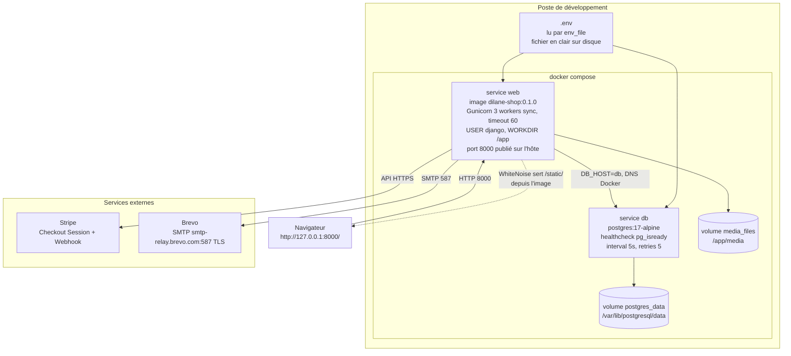
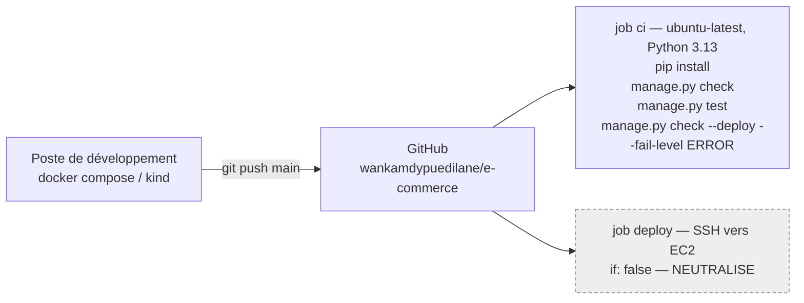
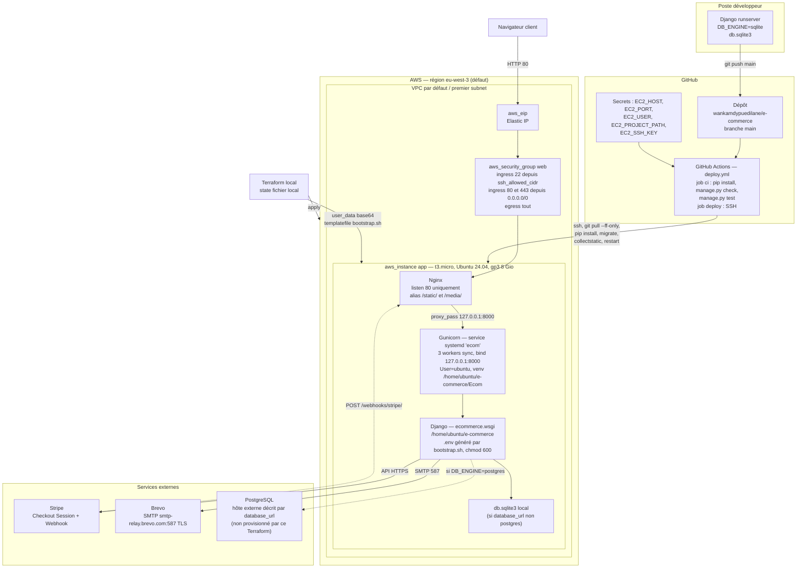

# Architecture

Document de rattrapage — état observé du dépôt au 20/09/2026, **après les Sprints 9 (conteneurisation) et 10 (Kubernetes)**.
Tout ce qui suit décrit le code tel qu'il existe, sans recommandation.

> **Mise à jour du 20/09/2026.** La version précédente de ce document décrivait l'état antérieur au Sprint 9 : base SQLite versionnée, déploiement sur une instance EC2 unique, aucun conteneur. Ce qui concerne AWS a été déplacé en [§5 Historique](#5-historique--déploiement-aws-ec2-jusquau-sprint-9) et n'est plus actif. Les sections 1 à 4 décrivent l'architecture actuelle : Docker Compose en local, Kubernetes pour le déploiement.

---

## 1. Arborescence commentée

```text
e-commerce/
├── manage.py                     # Point d'entrée CLI Django, DJANGO_SETTINGS_MODULE=ecommerce.settings
├── requirements.txt              # 7 dépendances épinglées (versions exactes)
├── Dockerfile                    # Image multi-stage python:3.13-slim, utilisateur non-root 'django'
├── docker-compose.yml            # Services 'web' et 'db', volumes nommés postgres_data et media_files
├── .dockerignore                 # Exclusions du contexte de build
├── README.md                     # Documentation projet, réécrite au commit 8e062e6
├── .env                          # Secrets locaux, ignoré par git, absent de l'image
├── .env.example                  # Gabarit des 26 variables d'environnement
├── .gitignore                    # Ignore .env, __pycache__, *.pyc, *.sqlite3, staticfiles/, media/, .venv/, tfstate
├── db.sqlite3                    # Présent sur le poste, NON versionné depuis le Sprint 9 (retiré de l'historique)
│
├── ecommerce/                    # Package de configuration Django (projet)
│   ├── settings.py               # Config unique, pilotée par os.getenv + python-dotenv (254 lignes)
│   ├── urls.py                   # URLconf racine : admin, reset password admin, include(shop.urls)
│   ├── wsgi.py                   # Point d'entrée WSGI utilisé par Gunicorn
│   └── asgi.py                   # Point d'entrée ASGI — présent mais jamais référencé
│
├── shop/                         # Unique app métier du projet
│   ├── models.py                 # 4 modèles : Category, Product, Commande, OrderItem
│   ├── views.py                  # 13 vues fonctionnelles + 1 helper (aucune CBV)
│   ├── urls.py                   # 18 routes, dont 4 PasswordReset* de django.contrib.auth
│   ├── services.py               # Couche métier : Stripe, TVA, email de confirmation (8 fonctions)
│   ├── forms.py                  # SignupForm (UserCreationForm + email) et EmailAuthenticationForm
│   ├── backends.py               # EmailOrUsernameModelBackend : login par email OU username
│   ├── admin.py                  # 4 ModelAdmin + inline OrderItem, branding "E-commerce"
│   ├── apps.py                   # ShopConfig, name='shop' (pas de default_auto_field)
│   ├── tests.py                  # 9 tests répartis en 4 TestCase
│   ├── migrations/               # 15 migrations (0001 → 0015), dont 2 data migrations
│   ├── static/shop/
│   │   └── favicon.svg           # Unique fichier statique du projet (aucun CSS/JS local)
│   └── templates/
│       ├── shop/                 # 13 templates métier + 2 templates d'email
│       ├── registration/         # 6 templates ; seuls password_reset_email.html
│       │                         #   et password_reset_subject.txt sont réellement résolus
│       └── admin/                # 5 templates, tous masqués par templates/admin/ (DIRS > APP_DIRS)
│
├── templates/                    # Répertoire déclaré dans TEMPLATES['DIRS'] (settings.py:24)
│   └── admin/                    # 7 templates de surcharge de l'admin Django, prioritaires
│
├── fixtures/
│   └── demo-catalogue.json       # 5 catégories + 25 produits, chargés par loaddata
│
├── k8s/                          # Manifestes Kubernetes (Sprint 10)
│   ├── kind-cluster.yaml         # Cluster local 3 nœuds : 1 control-plane + 2 workers
│   ├── 00-namespace.yaml         # Namespace dilane-shop
│   ├── 01-configmap.yaml         # 11 clés de configuration non sensible
│   ├── 02-secrets.example.yaml   # MODÈLE sans valeur — le Secret réel n'est jamais versionné
│   ├── 03-postgres.yaml          # Service headless + StatefulSet + volumeClaimTemplates 2 Gi
│   ├── 04-django.yaml            # Service ClusterIP + Deployment 2 replicas, probes, maxUnavailable 0
│   ├── 05-migration-job.yaml     # Job django-migrate, hors du cycle de vie des pods web
│   ├── 06-ingress.yaml           # Ingress nginx, hôte dilane-shop.local, redirection HTTPS
│   ├── 07-ingress-controller-patch.yaml  # Correctif de placement du contrôleur
│   └── 08-tls.yaml               # Issuer auto-signé + Certificate cert-manager
│
├── infra/terraform/              # ARCHIVE — infrastructure AWS, plus active (compte fermé)
│   ├── versions.tf               # terraform >= 1.6, provider aws ~> 5.0
│   ├── variables.tf              # 16 variables, 8 marquées sensitive
│   ├── main.tf                   # AMI Ubuntu 24.04, security group, EC2, Elastic IP
│   ├── outputs.tf                # instance_id, public_ip, public_dns, security_group_id
│   ├── bootstrap.sh              # Script cloud-init injecté via user_data (templatefile)
│   ├── README.md                 # Mode d'emploi Terraform
│   └── .gitignore                # Ignore .terraform/, tfstate, terraform.tfvars
│
├── .github/workflows/
│   ├── deploy.yml                # job 'ci' actif (Python 3.13) ; job 'deploy' EC2 neutralisé par if: false
│   └── README.md                 # Liste des 5 secrets GitHub attendus (job neutralisé)
│
├── scripts/                      # ARCHIVE — sauvegarde/restauration PostgreSQL, chemins obsolètes
│   ├── backup_postgres.sh        # pg_dump + gzip + rétention 14 jours
│   └── restore_postgres.sh       # gunzip + psql
│
└── docs/
    ├── ARCHITECTURE.md           # Ce document
    ├── AUDIT.md                  # Photographie du 20/09/2026, annotée de l'état de résolution
    ├── MODELE-DONNEES.md
    ├── HISTORIQUE.md
    ├── ops-backup.md             # Marqué obsolète en tête de fichier
    ├── terraform-next-step.md    # Préexistant, relatif à l'archive AWS
    ├── adr/
    │   ├── 001-conteneurisation.md
    │   ├── 002-kubernetes.md
    │   └── 003-monolithe-modulaire.md
    └── sprints/
        ├── sprint-09-docker.md
        └── sprint-10-kubernetes.md
```

**Changements d'arborescence depuis la version précédente de ce document :**

| Élément | Avant | Maintenant |
|---|---|---|
| `db.sqlite3` | Versionnée dans git | Retirée de l'index et de l'historique (issue #13). Le fichier subsiste sur le poste, ignoré par git et exclu de l'image. |
| `*/__pycache__/` | 17 fichiers `.pyc` versionnés | Désindexés (issue #25). `git ls-files` n'en liste plus aucun. |
| `Templates/` | Répertoire à majuscule | Renommé `templates/` (issue #27). `settings.py:24` a suivi. |
| Conteneurisation | Absente | `Dockerfile`, `docker-compose.yml`, `.dockerignore` |
| Kubernetes | Absent | `k8s/`, 10 manifestes |
| `infra/terraform/`, `scripts/` | Chaîne de déploiement active | Conservés comme archive documentaire |

---

## 2. Apps Django

`INSTALLED_APPS` contient 7 entrées : les 6 apps contrib de Django et une seule app projet (`settings.py:56-64`).

| App | Origine | Rôle observé dans ce projet |
|---|---|---|
| `django.contrib.admin` | Django | Back-office. Personnalisé dans `shop/admin.py` (site_header « E-commerce », site_title « SBC-shop », index_title « Manageur ») et surchargé graphiquement par `templates/admin/`. |
| `django.contrib.auth` | Django | Modèle `User` standard (aucun modèle utilisateur custom). Fournit les vues `PasswordReset*` câblées dans les deux URLconf. |
| `django.contrib.contenttypes` | Django | Dépendance d'`auth` et de l'admin. Pas d'usage direct dans le code métier. |
| `django.contrib.sessions` | Django | Sessions d'authentification. Backend par défaut (base de données). |
| `django.contrib.messages` | Django | Utilisé par 7 appels `messages.*` dans `shop/views.py` (succès checkout, connexion, inscription, déconnexion, annulation de paiement, erreurs de retour Stripe). |
| `django.contrib.staticfiles` | Django | Collecte `shop/static/` vers `STATIC_ROOT = BASE_DIR / 'staticfiles'`. Depuis le Sprint 9, les fichiers sont **servis par WhiteNoise**, pas par Nginx : middleware `whitenoise.middleware.WhiteNoiseMiddleware` en deuxième position (`settings.py:68`) et `STORAGES['staticfiles']` en `CompressedManifestStaticFilesStorage` (`settings.py:195-202`). `collectstatic` est exécuté pendant la construction de l'image. |
| `shop` | Projet | **Unique app métier.** Porte la totalité du domaine : catalogue, panier côté client, commandes, paiement Stripe, emails, authentification par email. Aucune séparation en sous-apps (pas d'app `orders`, `payments` ou `accounts` distincte). Le découpage en six apps est prévu au Sprint 12, conformément à l'[ADR-003](adr/003-monolithe-modulaire.md). |

### Découpage interne de `shop`

L'app n'est pas découpée en modules Django, mais en couches de fichiers :

- `views.py` — orchestration HTTP, validation des entrées POST, transactions.
- `services.py` — logique sans HTTP : `stripe_is_configured`, `get_tax_rate_percent`, `calculate_tax_totals`, `build_order_items_payload`, `send_order_confirmation_email`, `build_stripe_line_items`, `create_stripe_checkout_session`, `sync_commande_payment_from_stripe`.
- `backends.py` — authentification.
- `forms.py` — validation de formulaires d'inscription/connexion.

Le panier n'a **aucune existence serveur** : il vit intégralement dans le `localStorage` du navigateur, sous la clé `panier_user_<id>` (connecté) ou `panier_guest` (anonyme), définie dans `shop/templates/shop/base.html:175-176`. Il n'est transmis au serveur qu'au moment du POST `/checkout`, via un champ caché `items` contenant du JSON.

### Point d'entrée ajouté au Sprint 10

`shop/views.py:423` définit `healthz`, câblée sur `/healthz/` (`shop/urls.py:20`). La vue exécute un `SELECT 1` et retourne :

- `200` et `{"status": "ok", "database": "reachable"}` si la base répond ;
- `503` et `{"status": "degraded", "database": "unreachable"}` sinon.

Elle est sans authentification et sans gabarit : les sondes Kubernetes doivent pouvoir l'appeler avant que le pod ne reçoive du trafic. C'est la seule vue du projet écrite pour l'infrastructure et non pour un utilisateur.

---

## 3. Architecture d'exécution actuelle

Deux environnements exécutent **la même image**, construite depuis le `Dockerfile` : Docker Compose en local, Kubernetes pour le déploiement. L'arbitrage entre les deux est documenté dans l'[ADR-002](adr/002-kubernetes.md).

### 3.1 Exécution locale — Docker Compose



Points factuels :

- `web` déclare `depends_on: db: condition: service_healthy` : il ne démarre pas avant que `pg_isready` ne réussisse.
- Les migrations **ne sont pas jouées au démarrage**. Le `CMD` lance directement Gunicorn ; sur un volume `postgres_data` neuf, `migrate` doit être lancé à la main.
- Aucun Nginx : WhiteNoise sert les fichiers statiques depuis Gunicorn, avec une empreinte de contenu dans le nom des fichiers.
- Les secrets sont dans `.env`, en clair sur le disque de l'hôte, transmis au conteneur par `env_file`.

### 3.2 Déploiement — Kubernetes

Validé sur un cluster `kind` à trois nœuds (Kubernetes v1.37.0). La cible d'hébergement durable est `k3s` sur une VM Azure, non encore créée.


Points factuels sur ce déploiement :

- **Les migrations passent par un Job**, pas au démarrage des pods : avec deux replicas, plusieurs `migrate` s'exécuteraient en parallèle sur la même base.
- **Aucune image n'est téléchargée depuis un registre.** `imagePullPolicy: IfNotPresent` et `kind load docker-image` : l'image reste locale. Un déploiement distant exigera un registre, ce qui n'est pas fait.
- **Les secrets ne sont pas écrits sur le disque de l'hôte**, mais un Secret Kubernetes est encodé en base64, pas chiffré. Une commande `kubectl` suffit à lire une valeur en clair.
- **Le certificat est auto-signé.** Let's Encrypt ne peut pas valider `dilane-shop.local`, qui n'existe que dans le fichier `hosts` du poste. La durée (90 jours) et la fenêtre de renouvellement (15 jours) reprennent celles de Let's Encrypt pour que la bascule ne change que l'`issuerRef`.
- **Le placement du contrôleur Ingress est corrigé par un manifeste du dépôt.** Le manifeste `provider/kind` v1.15.1 ne contraint pas le contrôleur au nœud portant `ingress-ready=true` : son `nodeSelector` ne contient que `kubernetes.io/os: linux`. Sans le correctif, le pod peut se placer sur un worker, où les ports 80 et 443 ne sont pas mappés.
- **Le déploiement n'est pas automatisé.** Le job `deploy` de la CI reste neutralisé par `if: false` ; aucun job ne remplace encore le déploiement EC2.

### 3.3 Chaîne d'intégration continue



Le job `ci` s'exécute sur `python-version: "3.13"`, alignée sur l'image depuis l'issue #28. Les tests tournent sur le runner, pas dans l'image.

---

## 4. Inventaire des dépendances externes

### 4.1 Paquets Python (`requirements.txt`)

Les versions exactes sont épinglées dans `requirements.txt`, seule source de vérité : ce tableau n'indique que la série de chaque paquet, pour ne pas devenir faux à chaque mise à jour.

| Paquet | Série | Usage observé |
|---|---|---|
| `Django` | 6.1 | Framework. |
| `python-dotenv` | 1.2 | `load_dotenv(BASE_DIR / '.env')`. Import protégé par `try/except ImportError` avec un stub no-op (`settings.py:16-20`). Sans effet en conteneur, où les variables viennent de l'environnement. |
| `stripe` | 15 | SDK Stripe. Import protégé par `try/except ImportError` dans `views.py:24-27` et `services.py:11-14`. |
| `Pillow` | 12 | Requis par `Product.image_file` (`ImageField`). |
| `psycopg[binary]` | 3.3 | Driver PostgreSQL. `DB_ENGINE=postgres` dans tous les environnements conteneurisés. |
| `gunicorn` | 26 | Serveur WSGI, lancé par le `CMD` de l'image, interface de contrôle désactivée (`--no-control-socket`). |
| `whitenoise` | 6 | Sert les fichiers statiques depuis Gunicorn (ajouté au Sprint 9, issue #24). |

Aucune dépendance de développement (pas de `pytest`, `coverage`, `ruff`, `black`, ni de `requirements-dev.txt`).

### 4.2 Stripe

| Élément | Valeur observée |
|---|---|
| Variables | `STRIPE_PUBLIC_KEY`, `STRIPE_SECRET_KEY`, `STRIPE_WEBHOOK_SECRET` (`settings.py:184-186`) |
| Injection | `env_file: .env` sous Docker Compose ; `envFrom: secretRef` sous Kubernetes |
| Condition d'activation | `stripe_is_configured()` exige le module importé **+** `STRIPE_SECRET_KEY` **+** `STRIPE_PUBLIC_KEY`. `STRIPE_WEBHOOK_SECRET` n'entre pas dans ce test. |
| Mode | `stripe.checkout.Session.create(mode='payment', payment_method_types=['card'])`, devise `eur` |
| TVA | Ajoutée comme une ligne de produit supplémentaire nommée `TVA (<taux>%)`, pas via l'API Tax de Stripe |
| Métadonnée | `metadata={'commande_id': str(commande.id)}` |
| URLs de retour | `success_url` = `/paiement/succes/?session_id={CHECKOUT_SESSION_ID}&order_id=<id>`, `cancel_url` = `/paiement/annule/?order_id=<id>` |
| Webhook | `POST /webhooks/stripe/`, vue `stripe_webhook`, décorée `@csrf_exempt`, signature vérifiée par `stripe.Webhook.construct_event` |
| Événements traités | `checkout.session.completed` (synchronisation + décrément de stock) et `checkout.session.expired` (annulation + réincrément). Tout autre événement renvoie 200 sans traitement. |
| Lecture serveur | `sync_commande_payment_from_stripe` appelle `stripe.checkout.Session.retrieve` depuis 3 endroits : le webhook, `payment_success` et `confirmation`. |

Aucune clé publique Stripe n'est exposée dans les templates : il n'y a pas de Stripe.js, le paiement se fait par redirection vers l'URL de session hébergée.

**Accessibilité du webhook.** Le webhook suppose que Stripe puisse joindre l'application depuis Internet. Ce n'est le cas dans aucun des deux environnements actuels : le port 8000 de Docker Compose et l'hôte `dilane-shop.local` du cluster sont locaux. En l'état, le webhook ne peut être exercé qu'avec `stripe listen` ou un tunnel.

### 4.3 Brevo (email transactionnel)

| Élément | Valeur observée |
|---|---|
| Backend | `django.core.mail.backends.smtp.EmailBackend` — en dur, sans bascule console (`settings.py:175`) |
| Hôte | `smtp-relay.brevo.com`, port `587`, `EMAIL_USE_TLS = True` — tous en dur (`settings.py:176-178`) |
| Identifiants | `BREVO_SMTP_LOGIN` / `BREVO_SMTP_KEY` par variables d'environnement |
| Expéditeur | `EMAIL_FROM`, avec pour valeur par défaut codée en dur l'adresse personnelle `wankamdypuedilane@gmail.com` (`settings.py:181`) |
| Emails envoyés | 1) confirmation de commande (`send_order_confirmation_email`, multipart texte + HTML, `fail_silently=False`) ; 2) réinitialisation de mot de passe utilisateur ; 3) réinitialisation de mot de passe admin |
| Anti-doublon | Champ `Commande.confirmation_email_sent`, positionné à `True` après envoi |
| Déclencheurs de l'email de confirmation | `sync_commande_payment_from_stripe` (si passage à `paid`), plus deux rattrapages dans `payment_success` et `confirmation` |

### 4.4 Base de données

`settings.py:99-122` propose deux moteurs, sélectionnés par `DB_ENGINE` :

| Moteur | Condition | Configuration |
|---|---|---|
| SQLite | valeur par défaut, ou toute valeur ≠ `postgres` | `NAME = BASE_DIR / 'db.sqlite3'` |
| PostgreSQL | `DB_ENGINE=postgres` | `django.db.backends.postgresql`, variables `DB_NAME`, `DB_USER`, `DB_PASSWORD`, `DB_HOST` (défaut `127.0.0.1`), `DB_PORT` (défaut `5432`), `CONN_MAX_AGE` (défaut 60), `OPTIONS.sslmode` (défaut `prefer`) |

Remarques factuelles :

- La branche SQLite existe toujours dans le code, mais **aucun environnement conteneurisé ne l'emprunte** : `.env.example`, `k8s/01-configmap.yaml` et `docker-compose.yml` fixent tous `DB_ENGINE=postgres`, et `.dockerignore` exclut `*.sqlite3` de l'image. Elle ne subsiste que pour une exécution hors conteneur.
- `DB_HOST` est un nom de service, pas une adresse IP : `db` sous Docker Compose (DNS Docker), `postgres` sous Kubernetes (DNS du Service headless).
- `DB_SSLMODE=disable` dans les deux environnements : le trafic PostgreSQL ne sort pas du réseau du conteneur ou du cluster.
- Le code utilise `select_for_update()` dans `checkout` et `stripe_webhook`. Ce verrouillage a désormais partout la sémantique PostgreSQL.
- Les scripts `scripts/backup_postgres.sh` et `scripts/restore_postgres.sh` visent des chemins d'un serveur qui n'existe plus. **Il n'existe aucune procédure de sauvegarde active**, ni pour le volume `postgres_data`, ni pour le PVC `donnees-postgres-0`.

### 4.5 Dépendances front chargées par CDN

Référencées dans `shop/templates/shop/base.html`, non versionnées dans le dépôt :

| Ressource | Version | Ligne |
|---|---|---|
| Bootstrap CSS | 5.3.8 — `cdn.jsdelivr.net` | `base.html:15` |
| Popper | 2.11.8 — `cdn.jsdelivr.net` | `base.html:31` |
| Bootstrap JS | 5.3.8 — `cdn.jsdelivr.net` | `base.html:36` |

La feuille de style **Bootstrap Icons n'est pas chargée**, alors qu'une classe `bi bi-check-circle-fill` est utilisée dans `shop/templates/shop/confirmation.html:7`. Cette icône ne s'affiche donc pas. C'est le seul usage de `bi bi-*` du projet.

### 4.6 Dépendances d'infrastructure

| Élément | Détail |
|---|---|
| Images de base | `python:3.13-slim` (builder et runtime), `postgres:17-alpine` |
| Docker | Image applicative `dilane-shop`, étiquetée `0.1.0` dans `docker-compose.yml` et `0.2.0` dans `k8s/04-django.yaml` |
| kind | v0.33.0 — cluster `dilane-shop`, 3 nœuds, Kubernetes v1.37.0 |
| kubectl | v1.37.0 |
| ingress-nginx | v1.15.1, manifeste `provider/kind`, complété par `k8s/07-ingress-controller-patch.yaml` |
| cert-manager | v1.16.2, `Issuer` auto-signé déclaré dans `k8s/08-tls.yaml` |
| StorageClass | `standard` (`rancher.io/local-path`), fournie par kind, `WaitForFirstConsumer` |
| GitHub Actions | `actions/checkout@v5`, `actions/setup-python@v6` (Python 3.13), runner `ubuntu-latest` |
| AWS / Terraform | **Archive.** Provider `hashicorp/aws ~> 5.0`, backend local. Compte fermé, instance supprimée. |

---

## 5. Historique — déploiement AWS EC2 (jusqu'au Sprint 9)

> **Cette architecture n'est plus active.** Le compte AWS est fermé, l'instance est supprimée et le job `deploy` de la CI est neutralisé par `if: false` depuis l'issue #23. Les fichiers `infra/terraform/` et `scripts/` sont conservés dans le dépôt à titre documentaire. Le diagramme ci-dessous décrit ce que provisionnait `infra/terraform/` et ce qu'exécutait `bootstrap.sh`, tel qu'écrit dans ces fichiers — y compris leurs incohérences, détaillées en [§5 de l'audit](AUDIT.md) et dans l'[ADR-001](adr/001-conteneurisation.md).



### Points factuels sur ce déploiement

- Le port 443 était ouvert dans le security group, mais `bootstrap.sh` ne génère **aucun bloc `server` en écoute sur 443** et n'installe pas certbot. Aucun HTTPS n'était configuré. La terminaison TLS est désormais assurée par l'Ingress et cert-manager (§3.2).
- `SECURE_PROXY_SSL_HEADER` est toujours positionné en dur dans `settings.py:45`, et reste pertinent derrière l'Ingress.
- Le state Terraform était local : `versions.tf` ne déclare aucun backend distant.
- Terraform ne créait pas de base PostgreSQL. La variable `database_url` désignait un hôte supposé déjà existant ; sinon le bootstrap retombait sur SQLite.
- Le healthcheck de fin de bootstrap interrogeait `http://localhost/admin/`, une interface à laquelle aucun compte ne permettait de se connecter après un déploiement neuf.
- Le remplacement de cette chaîne est documenté dans l'[ADR-001](adr/001-conteneurisation.md) (conteneurisation) puis l'[ADR-002](adr/002-kubernetes.md) (Kubernetes).
