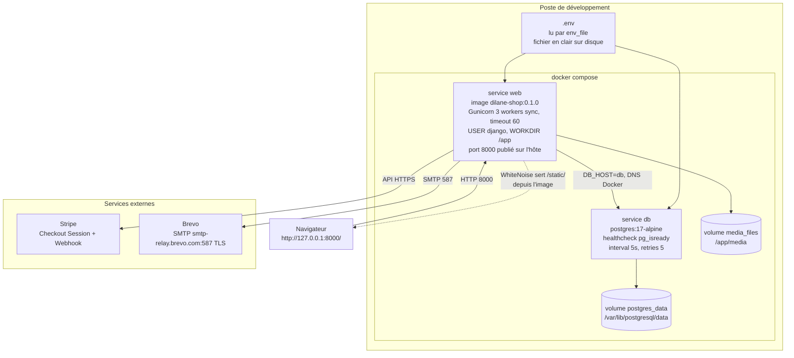
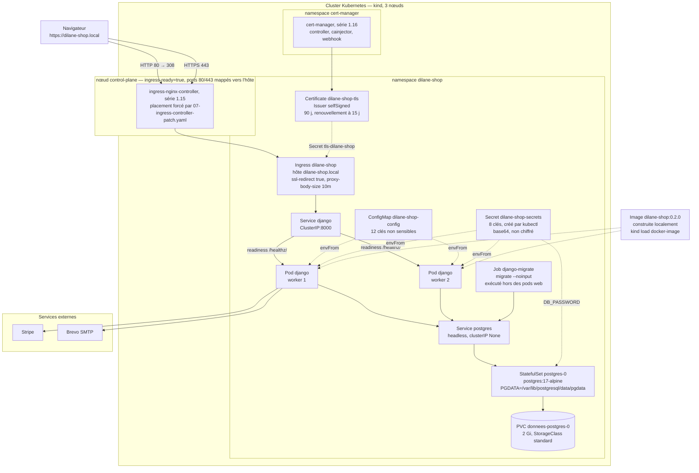
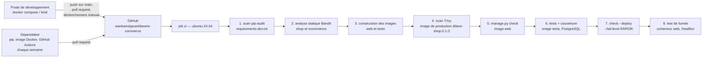
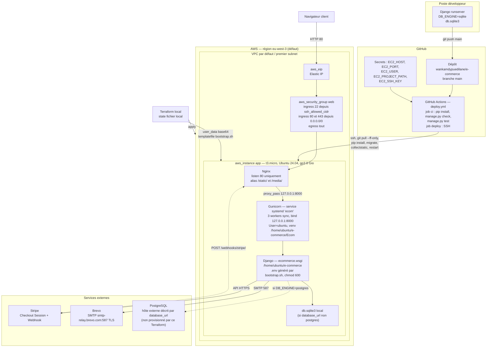

# Architecture

Document de rattrapage — état observé du dépôt au 23/09/2026, **après les Sprints 9 (conteneurisation), 10 (Kubernetes) et 11 (tests)**.
Tout ce qui suit décrit le code tel qu'il existe, sans recommandation.

> **Mise à jour du 20/09/2026.** La version précédente de ce document décrivait l'état antérieur au Sprint 9 : base SQLite versionnée, déploiement sur une instance EC2 unique, aucun conteneur. Ce qui concerne AWS a été déplacé en [§5 Historique](#5-historique--déploiement-aws-ec2-jusquau-sprint-9) et n'est plus actif. Les sections 1 à 4 décrivent l'architecture actuelle : Docker Compose en local, Kubernetes pour le déploiement.
>
> **Mise à jour du 23/09/2026.** Intègre le Sprint 11 et ce qui l'a suivi : étape `test` du Dockerfile et service Compose `tests`, mesure de couverture, workflow renommé `CI` (`.github/workflows/ci.yml`) sans job de déploiement, scan pip-audit, Dependabot, contrôle de propriétaire sur les pages de commande, code de l'image non modifiable par l'utilisateur `django` (#84), contexte de build réduit (#64), `.vscode/` retiré du dépôt.
>
> **Mise à jour du 24/09/2026.** Analyse statique Bandit ajoutée à la CI, juste après pip-audit et avant la construction des images (issue #36). Son seul constat, `mark_safe` dans `shop/admin.py`, est corrigé par `330c331`. Plus tard le même jour : pip retiré de l'image de production (étape `runtime` du Dockerfile) et scan de vulnérabilités de l'image par Trivy, juste après la construction des images. Enfin, en-têtes de sécurité HTTP (issue #38) : politique CSP native de Django avec jeton sur les scripts en ligne, et en-tête `Permissions-Policy` (voir la section « En-têtes de sécurité HTTP », §2).

---

## 1. Arborescence commentée

```text
e-commerce/
├── manage.py                     # Point d'entrée CLI Django, DJANGO_SETTINGS_MODULE=ecommerce.settings
├── requirements.txt              # 7 dépendances d'exécution épinglées (versions exactes)
├── requirements-dev.txt          # -r requirements.txt + coverage ; installé seulement dans l'étape 'test'
├── .coveragerc                   # Couverture : branches, sources shop et ecommerce, seuil fail_under en cliquet
├── Dockerfile                    # 4 étapes python:3.13-slim : builder, base, test, runtime (dernière)
├── docker-compose.yml            # Services 'web', 'db' et 'tests' (profil test), volumes postgres_data et media_files
├── .dockerignore                 # Exclusions du contexte de build, dont k8s/, Dockerfile, docker-compose.yml, .github/
├── README.md                     # Documentation projet
├── .env                          # Secrets locaux, ignoré par git, absent de l'image
├── .env.example                  # Gabarit des 26 variables d'environnement
├── .gitignore                    # Ignore .env, __pycache__, *.pyc, *.sqlite3, staticfiles/, media/, .venv/, .vscode/, tfstate
├── db.sqlite3                    # Présent sur le poste, NON versionné depuis le Sprint 9 (retiré de l'historique)
│
├── ecommerce/                    # Package de configuration Django (projet)
│   ├── settings.py               # Config unique, pilotée par os.getenv + python-dotenv (281 lignes)
│   ├── urls.py                   # URLconf racine : admin, reset password admin, include(shop.urls)
│   ├── wsgi.py                   # Point d'entrée WSGI utilisé par Gunicorn
│   └── asgi.py                   # Point d'entrée ASGI — présent mais jamais référencé
│
├── shop/                         # Unique app métier du projet
│   ├── models.py                 # 4 modèles : Category, Product, Commande, OrderItem
│   ├── views.py                  # 13 vues fonctionnelles + 1 helper (aucune CBV)
│   ├── urls.py                   # 18 routes, dont 4 PasswordReset* de django.contrib.auth
│   ├── services.py               # Couche métier : Stripe, TVA, email de confirmation (8 fonctions)
│   ├── forms.py                  # SignupForm (UserCreationForm + email) et EmailAuthenticationForm
│   ├── backends.py               # EmailOrUsernameModelBackend : login par email OU username
│   ├── middleware.py             # PermissionsPolicyMiddleware : en-tête Permissions-Policy, absent de Django
│   ├── admin.py                  # 4 ModelAdmin + inline OrderItem, branding "E-commerce"
│   ├── apps.py                   # ShopConfig, name='shop' (pas de default_auto_field)
│   ├── tests.py                  # 9 tests d'origine (modèle, checkout, authentification)
│   ├── test_webhook.py           # Webhook Stripe, signature réelle : 8 tests
│   ├── test_tva.py               # Calcul de TVA, SimpleTestCase : 10 tests
│   ├── test_stripe_session.py    # Lignes et session Stripe, SimpleTestCase : 6 tests
│   ├── test_auth.py              # Backend de connexion par email et formulaires : 13 tests
│   ├── test_acces_commandes.py   # Contrôle de propriétaire des pages de commande : 8 tests
│   ├── test_medias.py            # /app/media inscriptible par l'utilisateur django : 1 test
│   ├── test_image.py             # Code lisible mais non modifiable par django, dans l'image : 2 tests
│   ├── test_admin.py             # Échappement des titres dans le panier de l'admin : 2 tests
│   ├── test_entetes.py           # En-têtes de sécurité HTTP et jeton CSP sur quatre pages : 6 tests
│   ├── migrations/               # 15 migrations (0001 → 0015), dont 2 data migrations
│   ├── static/shop/
│   │   └── favicon.svg           # Unique fichier statique du projet (aucun CSS/JS local)
│   └── templates/
│       ├── shop/                 # 13 templates métier + 2 templates d'email
│       ├── registration/         # 6 templates ; seuls password_reset_email.html
│       │                         #   et password_reset_subject.txt sont réellement résolus
│       └── admin/                # 5 templates, tous masqués par templates/admin/ (DIRS > APP_DIRS)
│
├── templates/                    # Répertoire déclaré dans TEMPLATES['DIRS'] (settings.py:24)
│   └── admin/                    # 7 templates de surcharge de l'admin Django, prioritaires
│
├── fixtures/
│   └── demo-catalogue.json       # 5 catégories + 25 produits, chargés par loaddata
│
├── k8s/                          # Manifestes Kubernetes (Sprint 10)
│   ├── kind-cluster.yaml         # Cluster local 3 nœuds : 1 control-plane + 2 workers
│   ├── 00-namespace.yaml         # Namespace dilane-shop
│   ├── 01-configmap.yaml         # 12 clés de configuration non sensible
│   ├── 02-secrets.example.yaml   # MODÈLE sans valeur — le Secret réel n'est jamais versionné
│   ├── 03-postgres.yaml          # Service headless + StatefulSet + volumeClaimTemplates 2 Gi
│   ├── 04-django.yaml            # Service ClusterIP + Deployment 2 replicas, probes, maxUnavailable 0
│   ├── 05-migration-job.yaml     # Job django-migrate, hors du cycle de vie des pods web
│   ├── 06-ingress.yaml           # Ingress nginx, hôte dilane-shop.local, redirection HTTPS
│   ├── 07-ingress-controller-patch.yaml  # Correctif de placement du contrôleur
│   └── 08-tls.yaml               # Issuer auto-signé + Certificate cert-manager
│
├── infra/terraform/              # ARCHIVE — infrastructure AWS, plus active (compte fermé)
│   ├── versions.tf               # terraform >= 1.6, provider aws ~> 5.0
│   ├── variables.tf              # 16 variables, 8 marquées sensitive
│   ├── main.tf                   # AMI Ubuntu 24.04, security group, EC2, Elastic IP
│   ├── outputs.tf                # instance_id, public_ip, public_dns, security_group_id
│   ├── bootstrap.sh              # Script cloud-init injecté via user_data (templatefile)
│   ├── README.md                 # Mode d'emploi Terraform
│   └── .gitignore                # Ignore .terraform/, tfstate, terraform.tfvars
│
├── .github/
│   ├── dependabot.yml            # Mises à jour hebdomadaires : pip, image Docker, GitHub Actions
│   └── workflows/
│       ├── ci.yml                # Workflow 'CI' : un job 'ci', aucun déploiement, aucun secret
│       └── README.md             # Étapes de la CI
│
├── scripts/                      # ARCHIVE — sauvegarde/restauration PostgreSQL, chemins obsolètes
│   ├── backup_postgres.sh        # pg_dump + gzip + rétention 14 jours
│   └── restore_postgres.sh       # gunzip + psql
│
└── docs/
    ├── ARCHITECTURE.md           # Ce document
    ├── AUDIT.md                  # Photographie du 20/09/2026, annotée de l'état de résolution
    ├── MODELE-DONNEES.md
    ├── HISTORIQUE.md
    ├── definition-of-done.md     # Critères de fin de tâche, datés du Sprint 11
    ├── ops-backup.md             # Marqué obsolète en tête de fichier
    ├── terraform-next-step.md    # Marqué obsolète en tête de fichier, relatif à l'archive AWS
    ├── adr/
    │   ├── 001-conteneurisation.md
    │   ├── 002-kubernetes.md
    │   └── 003-monolithe-modulaire.md
    └── sprints/
        ├── sprint-09-docker.md
        ├── sprint-10-kubernetes.md
        └── sprint-11-tests.md
```

**Changements d'arborescence depuis la version précédente de ce document :**

| Élément | Avant | Maintenant |
|---|---|---|
| `db.sqlite3` | Versionnée dans git | Retirée de l'index et de l'historique (issue #13). Le fichier subsiste sur le poste, ignoré par git et exclu de l'image. |
| `*/__pycache__/` | 17 fichiers `.pyc` versionnés | Désindexés (issue #25). `git ls-files` n'en liste plus aucun. |
| `Templates/` | Répertoire à majuscule | Renommé `templates/` (issue #27). `settings.py:24` a suivi. |
| Conteneurisation | Absente | `Dockerfile`, `docker-compose.yml`, `.dockerignore` |
| Kubernetes | Absent | `k8s/`, 10 manifestes |
| `infra/terraform/`, `scripts/` | Chaîne de déploiement active | Conservés comme archive documentaire |

---

## 2. Apps Django

`INSTALLED_APPS` contient 7 entrées : les 6 apps contrib de Django et une seule app projet (`settings.py:56-64`).

| App | Origine | Rôle observé dans ce projet |
|---|---|---|
| `django.contrib.admin` | Django | Back-office. Personnalisé dans `shop/admin.py` (site_header « E-commerce », site_title « SBC-shop », index_title « Manageur ») et surchargé graphiquement par `templates/admin/`. |
| `django.contrib.auth` | Django | Modèle `User` standard (aucun modèle utilisateur custom). Fournit les vues `PasswordReset*` câblées dans les deux URLconf. |
| `django.contrib.contenttypes` | Django | Dépendance d'`auth` et de l'admin. Pas d'usage direct dans le code métier. |
| `django.contrib.sessions` | Django | Sessions d'authentification. Backend par défaut (base de données). |
| `django.contrib.messages` | Django | Utilisé par 7 appels `messages.*` dans `shop/views.py` (succès checkout, connexion, inscription, déconnexion, annulation de paiement, erreurs de retour Stripe). |
| `django.contrib.staticfiles` | Django | Collecte `shop/static/` vers `STATIC_ROOT = BASE_DIR / 'staticfiles'`. Depuis le Sprint 9, les fichiers sont **servis par WhiteNoise**, pas par Nginx : middleware `whitenoise.middleware.WhiteNoiseMiddleware` en deuxième position (`settings.py:68`) et `STORAGES['staticfiles']` en `CompressedManifestStaticFilesStorage` (`settings.py:198-205`). `collectstatic` est exécuté pendant la construction de l'image. |
| `shop` | Projet | **Unique app métier.** Porte la totalité du domaine : catalogue, panier côté client, commandes, paiement Stripe, emails, authentification par email. Aucune séparation en sous-apps (pas d'app `orders`, `payments` ou `accounts` distincte). Le découpage en six apps est prévu au Sprint 12, conformément à l'[ADR-003](adr/003-monolithe-modulaire.md). |

### Découpage interne de `shop`

L'app n'est pas découpée en modules Django, mais en couches de fichiers :

- `views.py` — orchestration HTTP, validation des entrées POST, transactions.
- `services.py` — logique sans HTTP : `stripe_is_configured`, `get_tax_rate_percent`, `calculate_tax_totals`, `build_order_items_payload`, `send_order_confirmation_email`, `build_stripe_line_items`, `create_stripe_checkout_session`, `sync_commande_payment_from_stripe`.
- `backends.py` — authentification.
- `forms.py` — validation de formulaires d'inscription/connexion.

Le panier n'a **aucune existence serveur** : il vit intégralement dans le `localStorage` du navigateur, sous la clé `panier_user_<id>` (connecté) ou `panier_guest` (anonyme), définie dans `shop/templates/shop/base.html:175-176`. Il n'est transmis au serveur qu'au moment du POST `/checkout`, via un champ caché `items` contenant du JSON.

### Contrôle d'accès aux pages de commande

Depuis l'issue #70 (`dd2e594`), les trois vues qui reçoivent un identifiant de commande exigent une connexion et ne cherchent que parmi les commandes de l'utilisateur connecté :

| Vue | Protection | Recherche de la commande |
|---|---|---|
| `confirmation` (`views.py:238-243`) | `@login_required(login_url='/connexion/')` | Sans identifiant : dernière commande **de l'utilisateur** (`filter(user=request.user)`). Avec identifiant : `get_object_or_404(Commande, id=order_id, user=request.user)`. |
| `payment_success` (`views.py:266-275`) | `@login_required(login_url='/connexion/')` | `get_object_or_404(Commande, id=order_id, user=request.user)` |
| `payment_cancel` (`views.py:293-297`) | `@login_required(login_url='/connexion/')` | `Commande.objects.filter(id=order_id, user=request.user).first()` |

La commande d'un autre client répond 404, pas 403 : un 403 confirmerait son existence. Une commande sans utilisateur n'est accessible à personne, sauf depuis l'admin. Ces règles sont vérifiées par `shop/test_acces_commandes.py`.

### Point d'entrée ajouté au Sprint 10

`shop/views.py:428` définit `healthz`, câblée sur `/healthz/` (`shop/urls.py:20`). La vue exécute un `SELECT 1` et retourne :

- `200` et `{"status": "ok", "database": "reachable"}` si la base répond ;
- `503` et `{"status": "degraded", "database": "unreachable"}` sinon.

Elle est sans authentification et sans gabarit : les sondes Kubernetes doivent pouvoir l'appeler avant que le pod ne reçoive du trafic, et le test de fumée de la CI l'interroge pour vérifier que le conteneur de production démarre. C'est la seule vue du projet écrite pour l'infrastructure et non pour un utilisateur.

### En-têtes de sécurité HTTP

Ajoutés à l'issue #38. Tous sont posés par des intergiciels, donc sur **toutes** les réponses : pages du site, admin, API JSON et `/healthz/`.

**Intergiciels, dans l'ordre de `MIDDLEWARE`** (`settings.py:66-77`) :

1. `django.middleware.security.SecurityMiddleware`
2. `whitenoise.middleware.WhiteNoiseMiddleware`
3. `django.middleware.csp.ContentSecurityPolicyMiddleware` : CSP native de Django 6, pose l'en-tête à partir de `SECURE_CSP`
4. `shop.middleware.PermissionsPolicyMiddleware` : intergiciel du projet (`shop/middleware.py`), Django ne fournissant pas cet en-tête ; il ne remplace pas un `Permissions-Policy` déjà posé (`setdefault`)
5. `django.contrib.sessions.middleware.SessionMiddleware`
6. `django.middleware.common.CommonMiddleware`
7. `django.middleware.csrf.CsrfViewMiddleware`
8. `django.contrib.auth.middleware.AuthenticationMiddleware`
9. `django.contrib.messages.middleware.MessageMiddleware`
10. `django.middleware.clickjacking.XFrameOptionsMiddleware`

**Processeur de contexte** : `django.template.context_processors.csp`, ajouté à `TEMPLATES`, fournit `csp_nonce` aux gabarits. Le jeton est tiré au hasard à chaque réponse. Il n'apparaît dans l'en-tête que si un gabarit l'a utilisé : `/healthz/`, qui n'en rend aucun, n'a pas de `'nonce-…'` dans sa politique.

**En-têtes envoyés**, relevés sur `/`, `/admin/login/` et `/healthz/` :

| En-tête | Valeur | Source |
|---|---|---|
| `Content-Security-Policy` | voir le tableau suivant | `SECURE_CSP` (`settings.py:266-281`) |
| `Permissions-Policy` | `camera=(), microphone=(), geolocation=(), usb=(), payment=()` | `shop/middleware.py` |
| `X-Frame-Options` | `DENY` | `XFrameOptionsMiddleware`, valeur par défaut |
| `X-Content-Type-Options` | `nosniff` | `SecurityMiddleware`, valeur par défaut |
| `Referrer-Policy` | `same-origin` | `SecurityMiddleware`, valeur par défaut |
| `Cross-Origin-Opener-Policy` | `same-origin` | `SecurityMiddleware`, valeur par défaut |
| `Strict-Transport-Security` | **non envoyé** | `SECURE_HSTS_SECONDS` vaut 0 par défaut (`settings.py:49`) ; reporté à l'issue #42, avec un certificat reconnu. Le certificat actuel est auto-signé, et HSTS rendrait le site inaccessible en cas d'erreur de certificat, sans possibilité de passer outre dans le navigateur. |

**Politique CSP**, appliquée par `SECURE_CSP` et non seulement observée : il n'y a pas d'en-tête `Content-Security-Policy-Report-Only`. Selon le commentaire de `settings.py`, elle a été appliquée après une phase d'observation en mode Report-Only. Aucune directive `report-uri` ou `report-to` n'est déclarée : une violation n'est visible que dans la console du navigateur.

| Directive | Valeur | Justification |
|---|---|---|
| `default-src` | `'self'` | Repli pour toute ressource non listée. |
| `script-src` | `'self'`, jeton, `cdn.jsdelivr.net`, `code.jquery.com` | Scripts verrouillés par jeton : les 6 blocs `<script>` en ligne de `base.html`, `index.html`, `checkout.html` et `confirmation.html` portent `nonce="{{ csp_nonce }}"`. Pas de `'unsafe-inline'` : un script injecté sans le jeton de la page n'est pas exécuté. Les deux domaines sont ceux de Bootstrap, Popper et jQuery (§4.5). |
| `style-src` | `'self'`, `'unsafe-inline'`, `cdn.jsdelivr.net` | **Exception assumée.** Les jetons ne s'appliquent pas aux attributs `style=` écrits dans le HTML, présents dans `index.html`, `detail.html` et `confirmation.html` ; le bloc `<style>` de `base.html` n'en porte pas non plus. Une injection de style est bien moins grave qu'une injection de script. |
| `img-src` | `'self'`, `https:`, `data:` | Les images de produits peuvent être des URL externes (`Product.image`). |
| `font-src` | `'self'`, `cdn.jsdelivr.net` | |
| `connect-src` | `'self'` | Limité au site, pour la recherche `/api/produits/`. Les cartes sources `.map` de jsDelivr sont bloquées, mais seuls les outils de développement ouverts les demandent, jamais la page d'un visiteur. |
| `form-action` | `'self'`, `checkout.stripe.com` | Autorise la redirection du formulaire de commande vers la page de paiement Stripe. **Non vérifié en conditions réelles** : les clés Stripe locales sont des valeurs d'exemple, et aucune session de paiement n'a pu être créée. |
| `frame-ancestors` | `'none'` | Le site ne peut être affiché dans aucun cadre, comme le prévoit déjà `X-Frame-Options: DENY`. |
| `base-uri` | `'self'` | |
| `object-src` | `'none'` | |

**Tests** : `shop/test_entetes.py`, 6 tests. L'un d'eux vérifie, sur quatre pages (accueil, fiche produit, commande, confirmation), que chaque script en ligne porte le jeton de la réponse. Vérifié dans les deux sens : les 6 tests passent sur le code actuel ; si l'on retire le jeton du script de `checkout.html`, ce test échoue sur la page « commande ». Le test limité à l'accueil ne l'aurait pas détecté.

---

## 3. Architecture d'exécution actuelle

Deux environnements exécutent **la même image**, construite depuis le `Dockerfile` : Docker Compose en local, Kubernetes pour le déploiement. L'arbitrage entre les deux est documenté dans l'[ADR-002](adr/002-kubernetes.md).

### 3.1 Image Docker

Le `Dockerfile` compte quatre étapes, toutes sur `python:3.13-slim` :

| Étape | Rôle |
|---|---|
| `builder` | Installe `build-essential` et `libpq-dev`, crée le virtualenv `/opt/venv` et y installe `requirements.txt`. |
| `base` | Installe la seule bibliothèque `libpq5`, crée l'utilisateur système `django`, copie `/opt/venv` et le code, exécute `collectstatic`, crée `/app/media`, bascule sur `USER django` et déclare le `CMD` Gunicorn. |
| `test` | Part de `base`, installe `requirements-dev.txt` (donc `coverage`) avec pip, qu'elle **conserve**. Construite seulement avec `--target test`, par le service Compose `tests`. Jamais déployée. |
| `runtime` | Part de `base` et **désinstalle pip**, à la fois du virtualenv (`/opt/venv`) et du Python système (`/usr/local`), puis revient à `USER django`. Le `CMD` est hérité de `base`. **Doit rester la dernière** : c'est l'étape que Docker construit sans `--target`, donc celle de `docker compose build web` et de `docker build` pour Kubernetes. |

**Pourquoi pip est absent de l'image de production.** L'application n'installe jamais de paquet à l'exécution : aucun appel à pip ni à `subprocess` dans `shop/` ou `ecommerce/`. pip n'y offrirait qu'un outil d'installation à un attaquant, et il embarque ses propres copies de bibliothèques dans `pip/_vendor`. Trivy y signalait deux failles HIGH disposant d'un correctif, dans `msgpack` et `setuptools`, présents dans l'image **uniquement** sous forme de ces copies, dans les deux installations de pip. Vérifié dans l'image : `python -m pip` échoue dans `/opt/venv` comme dans `/usr/local`, et Trivy ne trouve plus aucune faille HIGH ou CRITICAL corrigeable. La désinstallation se fait dans une couche supplémentaire : les fichiers de pip ne sont plus visibles dans le système de fichiers de l'image, mais restent dans une couche inférieure, si bien que la taille de l'image ne diminue pas.

Contenu de `/app`, vérifié dans une image construite depuis le dépôt : `manage.py`, `ecommerce/`, `shop/`, `templates/`, `fixtures/`, `staticfiles/`, `media/`, ainsi que `requirements.txt`, `requirements-dev.txt` (lu par l'étape `test`), `.coveragerc`, `.env.example` et `.dockerignore`. Depuis l'issue #64 (`a9b7014`), `.dockerignore` exclut aussi `k8s/`, `Dockerfile`, `docker-compose.yml` et `.github/`, qui décrivent l'infrastructure et ne servent pas à l'exécution. Il exclut par ailleurs, notamment, `.git/`, `.venv/`, `.env`, `*.sqlite3`, `staticfiles/`, `media/`, `.vscode/`, `docs/`, `infra/`, `scripts/` et `README.md`.

Propriété des fichiers, vérifiée dans la même image, sous l'utilisateur `django` :

- **tout `/app` appartient à `root`, sauf `/app/media`.** Depuis l'issue #84 (`80278b6`), le code est copié par `COPY . .` sans `--chown` : `django` peut le lire mais ni le modifier ni créer de fichier dans `/app`, `shop/` ou `ecommerce/`. Un processus compromis ne peut pas réécrire les vues ou la configuration qu'il exécute. Deux tests de `shop/test_image.py`, exécutés dans l'image de test, vérifient que le code reste lisible et non modifiable ;
- `/app/staticfiles` appartient aussi à `root` : `collectstatic` s'exécute pendant la construction, et WhiteNoise n'a besoin que de lire ces fichiers ;
- `/app/media` (créé par `mkdir` puis `chown`, issue #71) est **le seul emplacement de `/app` qui appartient à `django`**. Un volume monté dessus hérite de ce propriétaire ;
- puisque `/app` n'est pas inscriptible, `.coveragerc` écrit ses mesures dans `/tmp/.coverage` et Gunicorn est lancé avec `--no-control-socket`.

Le `CMD` lance `gunicorn --bind 0.0.0.0:8000 --workers 3 --worker-class sync --timeout 60`, journaux d'accès et d'erreur sur la sortie standard, et `--no-control-socket` : l'interface de contrôle de Gunicorn, apparue en série 25, tenterait sinon de créer son socket dans `/app` et journaliserait une erreur à chaque démarrage.

### 3.2 Exécution locale — Docker Compose



Points factuels :

- `web` déclare `depends_on: db: condition: service_healthy` : il ne démarre pas avant que `pg_isready` ne réussisse.
- Un troisième service, `tests`, construit l'étape `test` du Dockerfile (image `dilane-shop:test`), lit le même `.env` et dépend aussi de `db`. Il porte le profil `test` : `docker compose up` ne le démarre jamais, il n'est lancé que par `docker compose run --rm tests …`. Il n'apparaît pas sur le diagramme.
- Les migrations **ne sont pas jouées au démarrage**. Le `CMD` lance directement Gunicorn ; sur un volume `postgres_data` neuf, `migrate` doit être lancé à la main.
- Aucun Nginx : WhiteNoise sert les fichiers statiques depuis Gunicorn, avec une empreinte de contenu dans le nom des fichiers.
- Les secrets sont dans `.env`, en clair sur le disque de l'hôte, transmis au conteneur par `env_file`.

### 3.3 Déploiement — Kubernetes

Validé sur un cluster `kind` à trois nœuds (Kubernetes, série 1.37). La cible d'hébergement durable est `k3s` sur une VM Azure, non encore créée.



Points factuels sur ce déploiement :

- **Les migrations passent par un Job**, pas au démarrage des pods : avec deux replicas, plusieurs `migrate` s'exécuteraient en parallèle sur la même base.
- **Aucune image n'est téléchargée depuis un registre.** `imagePullPolicy: IfNotPresent` et `kind load docker-image` : l'image reste locale. Un déploiement distant exigera un registre, ce qui n'est pas fait.
- **Les secrets ne sont pas écrits sur le disque de l'hôte**, mais un Secret Kubernetes est encodé en base64, pas chiffré. Une commande `kubectl` suffit à lire une valeur en clair.
- **Le certificat est auto-signé.** Let's Encrypt ne peut pas valider `dilane-shop.local`, qui n'existe que dans le fichier `hosts` du poste. La durée (90 jours) et la fenêtre de renouvellement (15 jours) reprennent celles de Let's Encrypt pour que la bascule ne change que l'`issuerRef`.
- **Le placement du contrôleur Ingress est corrigé par un manifeste du dépôt.** Le manifeste `provider/kind` de la série 1.15, dans la version installée par le README, ne contraint pas le contrôleur au nœud portant `ingress-ready=true` : son `nodeSelector` ne contient que `kubernetes.io/os: linux`. Sans le correctif, le pod peut se placer sur un worker, où les ports 80 et 443 ne sont pas mappés.
- **Le déploiement n'est pas automatisé.** Aucun workflow ne déploie : l'image est construite et chargée à la main (`kind load docker-image`). La publication de l'image dans un registre depuis la CI est suivie par l'issue #43.

### 3.4 Chaîne d'intégration continue

Un seul workflow, nommé `CI`, fichier `.github/workflows/ci.yml` (anciennement `deploy.yml`, renommé au commit `1d37f77`, qui a aussi retiré le job de déploiement EC2).



- **Déclencheurs** : `push` sur `main`, `pull_request` (toutes branches, dont les propositions de Dependabot) et `workflow_dispatch`.
- **Runner** : `ubuntu-24.04`, épinglé plutôt que `ubuntu-latest`. Une seule action externe : `actions/checkout@v7`. Python n'est pas installé sur le runner : tout s'exécute dans des conteneurs.
- **Environnement** : `.env` est recopié depuis `.env.example`, avec une `DJANGO_SECRET_KEY` et un `DB_PASSWORD` aléatoires générés à chaque exécution. **Aucun secret GitHub n'est utilisé.**
- **Ordre des étapes** : scan pip-audit puis analyse statique Bandit, chacun dans un conteneur `python:3.13-slim` jetable, **avant toute construction** ; `docker compose build web tests` ; scan Trivy de l'image de production `dilane-shop:0.1.0`, dans un conteneur `aquasec/trivy` jetable ; démarrage de `db` ; `manage.py check` dans `web` ; `coverage run manage.py test && coverage report` dans `tests`, contre PostgreSQL, avec échec sous le seuil `fail_under` de `.coveragerc` ; `check --deploy --fail-level ERROR` dans `web` ; test de fumée ; arrêt de la pile par `docker compose down -v`, exécuté même en cas d'échec.
- **Test de fumée** : démarre le vrai conteneur `web`, attend jusqu'à 40 secondes que `/healthz/` réponde, puis échoue si les journaux de démarrage contiennent `[ERROR]`. Les tests passent par le client de test de Django et ne lancent jamais Gunicorn : sans cette étape, une erreur de démarrage passerait inaperçue.
- **Aucun job de déploiement.** Le futur déploiement Kubernetes fera l'objet d'un workflow distinct (issue #43).

---

## 4. Inventaire des dépendances externes

### 4.1 Paquets Python (`requirements.txt`)

Les versions exactes sont épinglées dans `requirements.txt`, seule source de vérité : ce tableau n'indique que la série de chaque paquet, pour ne pas devenir faux à chaque mise à jour.

| Paquet | Série | Usage observé |
|---|---|---|
| `Django` | 6.1 | Framework. |
| `python-dotenv` | 1.2 | `load_dotenv(BASE_DIR / '.env')`. Import protégé par `try/except ImportError` avec un stub no-op (`settings.py:16-20`). Sans effet en conteneur, où les variables viennent de l'environnement. |
| `stripe` | 15 | SDK Stripe. Import protégé par `try/except ImportError` dans `views.py:24-27` et `services.py:11-14`. |
| `Pillow` | 12 | Requis par `Product.image_file` (`ImageField`). |
| `psycopg[binary]` | 3.3 | Driver PostgreSQL. `DB_ENGINE=postgres` dans tous les environnements conteneurisés. |
| `gunicorn` | 26 | Serveur WSGI, lancé par le `CMD` de l'image, interface de contrôle désactivée (`--no-control-socket`). |
| `whitenoise` | 6 | Sert les fichiers statiques depuis Gunicorn (ajouté au Sprint 9, issue #24). |

**Dépendances de développement** (`requirements-dev.txt`) : le fichier inclut `requirements.txt` (`-r`) et n'ajoute que `coverage` (série 7). Il n'est installé que dans l'étape `test` du Dockerfile, jamais dans l'image de production. Aucun linter ni formateur n'est installé (pas de `ruff`, `black` ni `pytest`). Bandit n'y figure pas non plus : la CI l'installe dans un conteneur jetable.

**Surveillance des dépendances et du code :**

- **pip-audit** tourne dans la CI, avant toute construction, sur `requirements-dev.txt` (donc sur les dépendances d'exécution et de test). La version de pip-audit est épinglée dans la commande du workflow. Toute vulnérabilité connue fait échouer la CI.
- **Bandit** tourne juste après pip-audit, avant la construction des images, et analyse le code de `shop` et `ecommerce`, migrations et fichiers de test exclus (`-x '*/migrations/*,*/test*.py'`, soit 14 fichiers analysés). Sa version est épinglée dans la commande du workflow. Tout motif détecté fait échouer la CI, quelle que soit sa gravité : aucun seuil n'est passé à Bandit, et le dépôt ne contient ni fichier de configuration Bandit ni commentaire `# nosec`. Son seul constat au moment de l'ajout, `mark_safe` dans `shop/admin.py` (B308, B703), a été corrigé par `330c331` : `panier_lisible` construit désormais son HTML avec `format_html_join`, qui échappe chaque valeur insérée.
- **Trivy** tourne juste après la construction des images, avant le démarrage de la base. Il analyse l'image de production `dilane-shop:0.1.0` telle que construite, via le socket Docker du runner : paquets Debian du système et paquets Python. Options : `--scanners vuln --severity HIGH,CRITICAL --ignore-unfixed --exit-code 1`. Seules les failles graves ou critiques **disposant d'un correctif** sont retenues, et la CI échoue dès qu'il en trouve une. Sa version est épinglée par l'étiquette de l'image `aquasec/trivy`. L'image de test n'est pas analysée : elle conserve pip, et donc les deux failles de `pip/_vendor`. Vérifié dans les deux sens avec les options de la CI : code 0 sur l'image de production, code 1 sur l'image de test (2 failles HIGH, `msgpack` et `setuptools`). Aucune exception n'existe aujourd'hui. La commande de la CI monte le dépôt (`-v "$PWD:/src:ro" -w /src`), comme les étapes pip-audit et Bandit : un fichier `.trivyignore` placé à la racine du dépôt est pris en compte. Vérifié avec un fichier d'essai, qui était ignoré sans ce montage.
- **Dependabot** (`.github/dependabot.yml`) propose chaque semaine des pull requests pour trois écosystèmes : `pip`, `docker` (image de base du Dockerfile) et `github-actions`. La limite de pull requests ouvertes simultanément est fixée à 5 pour `pip`. Chaque proposition passe par la CI.

### 4.2 Stripe

| Élément | Valeur observée |
|---|---|
| Variables | `STRIPE_PUBLIC_KEY`, `STRIPE_SECRET_KEY`, `STRIPE_WEBHOOK_SECRET` (`settings.py:187-189`) |
| Injection | `env_file: .env` sous Docker Compose ; `envFrom: secretRef` sous Kubernetes |
| Condition d'activation | `stripe_is_configured()` exige le module importé **+** `STRIPE_SECRET_KEY` **+** `STRIPE_PUBLIC_KEY`. `STRIPE_WEBHOOK_SECRET` n'entre pas dans ce test. |
| Mode | `stripe.checkout.Session.create(mode='payment', payment_method_types=['card'])`, devise `eur` |
| TVA | Ajoutée comme une ligne de produit supplémentaire nommée `TVA (<taux>%)`, pas via l'API Tax de Stripe |
| Métadonnée | `metadata={'commande_id': str(commande.id)}` |
| URLs de retour | `success_url` = `/paiement/succes/?session_id={CHECKOUT_SESSION_ID}&order_id=<id>`, `cancel_url` = `/paiement/annule/?order_id=<id>` |
| Webhook | `POST /webhooks/stripe/`, vue `stripe_webhook`, décorée `@csrf_exempt`, signature vérifiée par `stripe.Webhook.construct_event` |
| Événements traités | `checkout.session.completed` (synchronisation + décrément de stock) et `checkout.session.expired` (annulation + réincrément). Tout autre événement renvoie 200 sans traitement. Une erreur pendant le traitement de `checkout.session.completed` renvoie 500, pour que Stripe renvoie l'événement (`6f177e9`). |
| Lecture serveur | `sync_commande_payment_from_stripe` appelle `stripe.checkout.Session.retrieve` depuis 3 endroits : le webhook, `payment_success` et `confirmation`. |

Aucune clé publique Stripe n'est exposée dans les templates : il n'y a pas de Stripe.js, le paiement se fait par redirection vers l'URL de session hébergée.

**Accessibilité du webhook.** Le webhook suppose que Stripe puisse joindre l'application depuis Internet. Ce n'est le cas dans aucun des deux environnements actuels : le port 8000 de Docker Compose et l'hôte `dilane-shop.local` du cluster sont locaux. En l'état, le webhook ne peut être exercé qu'avec `stripe listen` ou un tunnel.

### 4.3 Brevo (email transactionnel)

| Élément | Valeur observée |
|---|---|
| Backend | `django.core.mail.backends.smtp.EmailBackend` — en dur, sans bascule console (`settings.py:178`) |
| Hôte | `smtp-relay.brevo.com`, port `587`, `EMAIL_USE_TLS = True` — tous en dur (`settings.py:179-181`) |
| Identifiants | `BREVO_SMTP_LOGIN` / `BREVO_SMTP_KEY` par variables d'environnement |
| Expéditeur | `EMAIL_FROM`, avec pour valeur par défaut codée en dur l'adresse personnelle `wankamdypuedilane@gmail.com` (`settings.py:184`) |
| Emails envoyés | 1) confirmation de commande (`send_order_confirmation_email`, multipart texte + HTML, `fail_silently=False`) ; 2) réinitialisation de mot de passe utilisateur ; 3) réinitialisation de mot de passe admin |
| Anti-doublon | Champ `Commande.confirmation_email_sent`, positionné à `True` après envoi |
| Dépréciation | Django 6.1 déprécie les réglages `EMAIL_*` au profit de `MAILERS` : la configuration actuelle produit des avertissements de dépréciation. Migration suivie par l'issue #82. |
| Déclencheurs de l'email de confirmation | `sync_commande_payment_from_stripe` (si passage à `paid`), plus deux rattrapages dans `payment_success` et `confirmation` |

### 4.4 Base de données

`settings.py:102-125` propose deux moteurs, sélectionnés par `DB_ENGINE` :

| Moteur | Condition | Configuration |
|---|---|---|
| SQLite | valeur par défaut, ou toute valeur ≠ `postgres` | `NAME = BASE_DIR / 'db.sqlite3'` |
| PostgreSQL | `DB_ENGINE=postgres` | `django.db.backends.postgresql`, variables `DB_NAME`, `DB_USER`, `DB_PASSWORD`, `DB_HOST` (défaut `127.0.0.1`), `DB_PORT` (défaut `5432`), `CONN_MAX_AGE` (défaut 60), `OPTIONS.sslmode` (défaut `prefer`) |

Remarques factuelles :

- La branche SQLite existe toujours dans le code, mais **aucun environnement conteneurisé ne l'emprunte** : `.env.example`, `k8s/01-configmap.yaml` et `docker-compose.yml` fixent tous `DB_ENGINE=postgres`, et `.dockerignore` exclut `*.sqlite3` de l'image. Elle ne subsiste que pour une exécution hors conteneur.
- `DB_HOST` est un nom de service, pas une adresse IP : `db` sous Docker Compose (DNS Docker), `postgres` sous Kubernetes (DNS du Service headless).
- `DB_SSLMODE=disable` dans les deux environnements : le trafic PostgreSQL ne sort pas du réseau du conteneur ou du cluster.
- Le code utilise `select_for_update()` dans `checkout` et `stripe_webhook`. Ce verrouillage a désormais partout la sémantique PostgreSQL.
- Les scripts `scripts/backup_postgres.sh` et `scripts/restore_postgres.sh` visent des chemins d'un serveur qui n'existe plus. **Il n'existe aucune procédure de sauvegarde active**, ni pour le volume `postgres_data`, ni pour le PVC `donnees-postgres-0`. La sauvegarde automatisée est suivie par l'issue #83.

### 4.5 Dépendances front chargées par CDN

Référencées dans `shop/templates/shop/base.html`, non versionnées dans le dépôt. La version exacte figure dans chaque URL :

| Ressource | Série | Ligne |
|---|---|---|
| Bootstrap CSS | 5.3 — `cdn.jsdelivr.net` | `base.html:15` |
| jQuery « slim » | 4.0 — `code.jquery.com` | `base.html:26` |
| Popper | 2.11 — `cdn.jsdelivr.net` | `base.html:31` |
| Bootstrap JS | 5.3 — `cdn.jsdelivr.net` | `base.html:36` |

Chaque balise porte un attribut `integrity` : le navigateur refuse un fichier modifié sur le CDN. Ces deux domaines sont les seuls autorisés en plus du site par la directive `script-src` de la politique CSP (§2).

jQuery était chargé deux fois jusqu'au 24/09/2026, en séries 4.0 puis 3.3 « slim » ; la seconde remplaçait la première, si bien que la version réellement exécutée était concernée par CVE-2020-11022 et CVE-2020-11023. Une seule version subsiste, en 4.0 « slim » : le code n'appelle que `on`, `val`, `append`, `closest`, `find` et `attr`, toutes présentes dans cette version. L'empreinte `integrity` a été calculée sur le fichier téléchargé. Le test `shop/test_navigateur.py` vérifie qu'une seule version est chargée et qu'elle n'est pas antérieure à 3.5 : aucun outil de la CI ne surveille les bibliothèques servies par CDN, puisque pip-audit et Trivy analysent le serveur.

La feuille de style **Bootstrap Icons n'est pas chargée**, alors qu'une classe `bi bi-check-circle-fill` est utilisée dans `shop/templates/shop/confirmation.html:7`. Cette icône ne s'affiche donc pas. C'est le seul usage de `bi bi-*` du projet.

### 4.6 Dépendances d'infrastructure

| Élément | Détail |
|---|---|
| Images de base | `python:3.13-slim` (les quatre étapes du Dockerfile, et les conteneurs jetables du scan pip-audit et de l'analyse Bandit en CI), `postgres:17-alpine` |
| Outils de CI | `aquasec/trivy`, série 0.74, conteneur jetable du scan de l'image. L'étiquette est épinglée dans `ci.yml` ; Dependabot ne la met pas à jour, puisque son écosystème `docker` ne surveille que le Dockerfile. |
| Docker | Image applicative `dilane-shop`, étiquetée `0.1.0` dans `docker-compose.yml` et `0.2.0` dans `k8s/04-django.yaml` et `k8s/05-migration-job.yaml` ; image de test `dilane-shop:test`. Les deux étiquettes applicatives désignent aujourd'hui des contenus différents (issue #31). |
| kind | Série 0.33 — cluster `dilane-shop`, 3 nœuds, Kubernetes série 1.37 |
| kubectl | Série 1.37 |
| ingress-nginx | Série 1.15, manifeste `provider/kind`, complété par `k8s/07-ingress-controller-patch.yaml` |
| cert-manager | Série 1.16, `Issuer` auto-signé déclaré dans `k8s/08-tls.yaml` |
| StorageClass | `standard` (`rancher.io/local-path`), fournie par kind, `WaitForFirstConsumer` |
| GitHub Actions | `actions/checkout@v7`, runner `ubuntu-24.04`. Aucune autre action : Python et les outils s'exécutent dans des conteneurs. |
| AWS / Terraform | **Archive.** Provider `hashicorp/aws ~> 5.0`, backend local. Compte fermé, instance supprimée. |

---

## 5. Historique — déploiement AWS EC2 (jusqu'au Sprint 9)

> **Cette architecture n'est plus active.** Le compte AWS est fermé, l'instance est supprimée. Le job `deploy` de la CI, neutralisé par `if: false` à l'issue #23, a été supprimé au commit `1d37f77`, en même temps que le renommage de `deploy.yml` en `ci.yml` ; il reste consultable dans l'historique Git. Les fichiers `infra/terraform/` et `scripts/` sont conservés dans le dépôt à titre documentaire. Le diagramme ci-dessous décrit ce que provisionnait `infra/terraform/` et ce qu'exécutait `bootstrap.sh`, tel qu'écrit dans ces fichiers — y compris leurs incohérences, détaillées en [§5 de l'audit](AUDIT.md) et dans l'[ADR-001](adr/001-conteneurisation.md).



### Points factuels sur ce déploiement

- Le port 443 était ouvert dans le security group, mais `bootstrap.sh` ne génère **aucun bloc `server` en écoute sur 443** et n'installe pas certbot. Aucun HTTPS n'était configuré. La terminaison TLS est désormais assurée par l'Ingress et cert-manager (§3.3).
- `SECURE_PROXY_SSL_HEADER` est toujours positionné en dur dans `settings.py:45`, et reste pertinent derrière l'Ingress.
- Le state Terraform était local : `versions.tf` ne déclare aucun backend distant.
- Terraform ne créait pas de base PostgreSQL. La variable `database_url` désignait un hôte supposé déjà existant ; sinon le bootstrap retombait sur SQLite.
- Le healthcheck de fin de bootstrap interrogeait `http://localhost/admin/`, une interface à laquelle aucun compte ne permettait de se connecter après un déploiement neuf.
- Le remplacement de cette chaîne est documenté dans l'[ADR-001](adr/001-conteneurisation.md) (conteneurisation) puis l'[ADR-002](adr/002-kubernetes.md) (Kubernetes).
