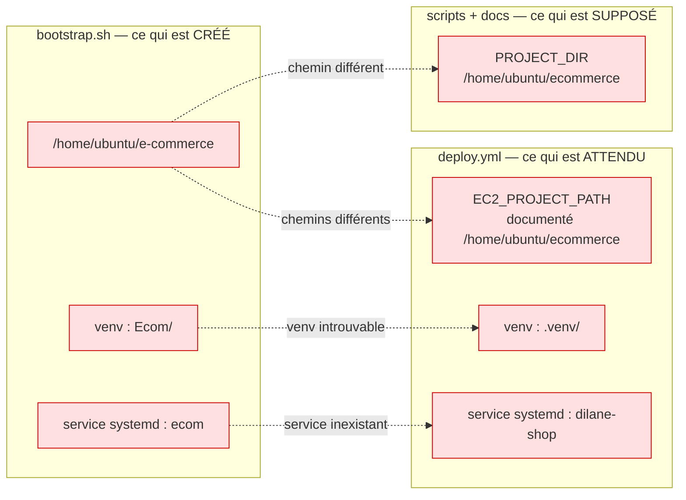

# Audit du projet

État observé au 20/09/2026, sur le dépôt à jour du commit `890a472`.
Ce document constate. Il ne propose aucune correction.

---

> **Note d'annotation — 20/09/2026, après les Sprints 9 et 10.**
>
> Ce document est une **photographie datée** : aucun de ses constats n'a été réécrit, y compris ceux qui ne sont plus vrais. Les numéros de ligne, les extraits de code et les chiffres cités décrivent le dépôt au commit `890a472`, avant la conteneurisation.
>
> Deux précisions utiles à la lecture :
>
> - L'historique Git a été réécrit à l'issue #13 pour en retirer `db.sqlite3`. **Le commit `890a472` n'existe plus** sous cet identifiant : il correspond à `ed22a22` dans l'historique actuel.
> - Les sections 1 à 5 sont conservées telles quelles. Seule la **section 6** a reçu une colonne « Statut au 20/09/2026 (soir) », qui indique pour chaque dette si elle est résolue, par quelle issue, et ce qui a été vérifié. Les colonnes d'origine sont inchangées.
>
> Bilan : **11 dettes résolues sur 40**, 3 devenues sans objet avec l'arrêt du déploiement EC2, 26 toujours ouvertes. Aucune dette de criticité 2 portant sur le code applicatif n'a été traitée : les Sprints 9 et 10 ont porté sur l'infrastructure.

---

## 1. Fonctionnalités réellement implémentées

### 1.1 Table des routes

`ecommerce/urls.py` (URLconf racine) + `shop/urls.py` (16 routes).

| URL | Nom | Vue | Template rendu | Protection |
|---|---|---|---|---|
| `/` | `home` | `index` | `shop/index.html` | publique |
| `/<int:myid>` | `detail` | `detail` | `shop/detail.html` | publique |
| `/api/produits/` | `search_products` | `search_products` | JSON | publique |
| `/checkout` | `checkout` | `checkout` | `shop/checkout.html` | `@login_required` |
| `/confirmation/<int:order_id>/` | `confirmation_order` | `confirmation` | `shop/confirmation.html` | **aucune** |
| `/confirmation` | `confirmation` | `confirmation` | `shop/confirmation.html` | **aucune** |
| `/paiement/succes/` | `payment_success` | `payment_success` | redirection | **aucune** |
| `/paiement/annule/` | `payment_cancel` | `payment_cancel` | redirection | **aucune** |
| `/webhooks/stripe/` | `stripe_webhook` | `stripe_webhook` | HTTP 200/400 | `@csrf_exempt` + signature Stripe |
| `/inscription/` | `inscription` | `inscription` | `shop/inscription.html` | publique |
| `/connexion/` | `connexion` | `connexion` | `shop/connexion.html` | publique |
| `/deconnexion/` | `deconnexion` | `deconnexion` | redirection | **GET accepté** |
| `/profil/` | `profil` | `profil` | `shop/mes_commandes.html` | `@login_required` |
| `/mot-de-passe-oublie/` | `password_reset` | `PasswordResetView` | `shop/password_reset_form.html` | publique |
| `/mot-de-passe-oublie/envoye/` | `password_reset_done` | `PasswordResetDoneView` | `shop/password_reset_done.html` | publique |
| `/reinitialisation/<uidb64>/<token>/` | `password_reset_confirm` | `PasswordResetConfirmView` | `shop/password_reset_confirm.html` | token signé |
| `/reinitialisation/terminee/` | `password_reset_complete` | `PasswordResetCompleteView` | `shop/password_reset_complete.html` | publique |
| `/admin/` | — | `admin.site.urls` | admin Django | staff |
| `/gestion/` | `admin_shortcut` | `RedirectView` | redirection vers `/admin/` | **aucune** (redirige) |
| `/admin/password_reset/` (+3 routes) | `admin_password_reset*` | `PasswordReset*View` | `admin/password_reset_*.html` | publique |

### 1.2 Ce qui fonctionne de bout en bout

**Catalogue.** `index` charge les produits avec `select_related('category')`, applique un filtre `title__icontains` sur le paramètre GET `item-name` et un filtre catégorie sur `category` (validé par `.isdigit()`), puis pagine par 4. Les badges de stock (« Rupture de stock », « Plus que N en stock », « En stock ») sont rendus dans `index.html` et `detail.html`.

**Recherche AJAX.** `search_products` renvoie un JSON de 24 produits maximum. Elle est réellement consommée : `shop/templates/shop/index.html:501` fait un `fetch("/api/produits/?" + params)`.

**Panier.** Entièrement côté navigateur, en `localStorage`. La clé est calculée par template dans `base.html:175-176` : `panier_user_<id>` si connecté, `panier_guest` sinon — les paniers de deux comptes sur le même navigateur sont donc séparés. La logique d'ajout/incrément/décrément/suppression est dupliquée entre `index.html`, `detail.html` et `checkout.html`. Le panier est purgé après paiement par `confirmation.html:65-77`, qui supprime toutes les clés préfixées `panier_`.

**Checkout avec recalcul serveur.** C'est la partie la plus aboutie du code (`views.py:99-235`) :
- validation de `nom`, `email`, `address` ;
- parsing défensif du JSON `items` (`json.JSONDecodeError`/`TypeError` interceptés) ;
- agrégation des quantités par `product_id`, rejet des quantités < 1 et des ids non entiers ;
- `transaction.atomic()` + `select_for_update()` sur les produits ;
- **le prix est relu depuis la base** (`prix_reel = product.price`) ; tout prix envoyé par le client est ignoré ;
- contrôle de stock avant création ;
- calcul de TVA par `calculate_tax_totals` (`ROUND_HALF_UP`, 2 décimales) ;
- création de la `Commande` puis `bulk_create` des `OrderItem`.

**Paiement Stripe.** Session Checkout créée en mode `payment`, devise EUR, TVA ajoutée comme ligne supplémentaire, `metadata.commande_id` renseignée. Redirection vers l'URL hébergée par Stripe. Retour géré par `payment_success` et `payment_cancel`.

**Webhook Stripe.** Signature vérifiée par `stripe.Webhook.construct_event`. Deux événements traités :
- `checkout.session.completed` : rapprochement par `stripe_checkout_session_id` avec repli sur `metadata.commande_id`, puis décrément de stock sous `transaction.atomic()` + `select_for_update()` sur la commande et sur chaque produit, protégé par le drapeau `stock_deducted` ;
- `checkout.session.expired` : passage en `cancelled` et réincrément du stock si `stock_deducted`.

**Idempotence.** Deux verrous en base fonctionnent réellement : `stock_deducted` (stock décrémenté une seule fois) et `confirmation_email_sent` (email envoyé une seule fois malgré 3 chemins d'appel possibles).

**Emails.** `send_order_confirmation_email` construit un `EmailMultiAlternatives` : corps texte obligatoire (`order_confirmation_email.txt`), alternative HTML optionnelle (`order_confirmation_email.html`) dont l'échec de rendu est intercepté et journalisé sans bloquer l'envoi.

**Authentification.** Inscription (`SignupForm`, `UserCreationForm` + email obligatoire avec contrôle d'unicité applicatif), connexion par **email ou username** via `EmailOrUsernameModelBackend`, déconnexion, et réinitialisation de mot de passe complète — en deux parcours distincts, un pour le site et un pour l'admin.

**Admin.** 4 `ModelAdmin` enregistrés. `AdminCommande` affiche le panier reconstitué en HTML (`panier_lisible`), avec un inline `OrderItem` en lecture seule et `can_delete=False`. `list_editable` sur `status`/`payment_status` (commandes) et `price`/`stock` (produits).

**Exploitation.** Sauvegarde/restauration PostgreSQL avec rétention de 14 jours, CI/CD GitHub Actions, IaC Terraform, bootstrap cloud-init.

---

## 2. Fonctionnalités incomplètes ou mortes

### 2.1 Chemin de commande sans Stripe — incomplet

Si `stripe_is_configured()` est faux, `create_stripe_checkout_session` retourne `None`. Le flux sort alors du bloc `atomic` et tombe sur `views.py:230-231` : message de succès, redirection vers la confirmation. La commande existe en base, mais :

- `payment_status` reste `pending` et `status` reste `pending` ;
- **le stock n'est jamais décrémenté** (il ne l'est que dans le webhook) ;
- **aucun email de confirmation n'est envoyé** (il ne l'est que sur passage à `paid`) ;
- la page affiche pourtant « Commande Confirmée ! » (`confirmation.html:12`) et vide le panier, car `clear_cart` est vrai dès que le statut vaut `paid` **ou** `processing`… mais pas `pending`, donc ici le panier n'est pas vidé.

Résultat : une commande orpheline, sans paiement, sans email, sans mouvement de stock. C'est exactement le chemin qu'empruntent 3 des 9 tests, qui forcent `STRIPE_SECRET_KEY=""`.

### 2.2 Statuts jamais atteints par le code

- `payment_status = 'failed'` : la valeur est déclarée dans `PAYMENT_STATUS_CHOICES` et traitée par `confirmation.html`, mais **aucune ligne du projet ne l'écrit**. Les événements Stripe `payment_intent.payment_failed` et `checkout.session.async_payment_failed` ne sont pas traités.
- `status = 'shipped'` et `status = 'delivered'` : atteignables uniquement par édition manuelle dans l'admin. Aucune logique applicative, aucune notification associée.

### 2.3 Templates morts

| Fichier | Pourquoi il ne sert pas |
|---|---|
| `shop/templates/shop/profil.html` | La vue `profil` rend `shop/mes_commandes.html`. Ce template n'est référencé nulle part. |
| `shop/templates/admin/login.html` | Masqué par `Templates/admin/login.html` : `TEMPLATES['DIRS']` est résolu avant `APP_DIRS`. |
| `shop/templates/admin/password_reset_form.html` | idem |
| `shop/templates/admin/password_reset_done.html` | idem |
| `shop/templates/admin/password_reset_confirm.html` | idem |
| `shop/templates/admin/password_reset_complete.html` | idem |
| `shop/templates/registration/password_reset_form.html` | `shop/urls.py` pointe explicitement sur `shop/password_reset_form.html`. |
| `shop/templates/registration/password_reset_done.html` | idem |
| `shop/templates/registration/password_reset_confirm.html` | idem |
| `shop/templates/registration/password_reset_complete.html` | idem |

Seuls `registration/password_reset_email.html` et `registration/password_reset_subject.txt` sont réellement résolus dans ce répertoire.
**Total : 10 templates inertes**, plus 5 doublons de contenu entre `Templates/admin/` et `shop/templates/admin/`.

### 2.4 Champs et code morts

- `ecommerce/asgi.py` : généré par `startproject`, jamais référencé. Le déploiement utilise exclusivement `ecommerce.wsgi`.
- `checkout.html:126-133` : le champ `<input name="total">` est soumis dans le POST mais **jamais lu** par la vue. C'est un vestige inoffensif — le serveur recalcule tout.
- `Product.image` : champ « URL legacy » conservé après l'ajout de `image_file` en migration 0011. Les deux coexistent, arbitrés par `display_image_url`.
- `admin.py:23` : `inlines = []` déclaré dans la classe puis écrasé ligne 47 par `AdminCommande.inlines = [OrderItemInline]`. La première déclaration ne sert à rien.
- `shop/apps.py` : `ShopConfig` ne définit ni `default_auto_field` ni `verbose_name`, et n'est pas déclaré dans `INSTALLED_APPS` (qui contient `'shop'` en chaîne courte). Il est bien découvert automatiquement, mais n'apporte rien.
- `infra/terraform/README.md:23` documente `cp terraform.tfvars.example terraform.tfvars` — **ce fichier a été supprimé** au commit `e75041d`. L'instruction est cassée.

### 2.5 Fonctionnalités absentes malgré des amorces

- Aucune page de liste des commandes côté admin autre que celle de Django.
- Aucun envoi d'email pour les changements de statut logistique.
- Aucune gestion de remboursement (pas d'appel `stripe.Refund`).
- Aucune facture PDF, malgré la présence de `subtotal_ht` / `tax_amount` / `total`.
- Aucun `CSRF_TRUSTED_ORIGINS` dans `settings.py`, alors que le déploiement est derrière un proxy.
- Aucune configuration `LOGGING` explicite : les `logger.exception` de `views.py` et `services.py` suivent la configuration Django par défaut.

---

## 3. Couverture de tests réelle

**Oui, il y a des tests.** Un seul fichier : `shop/tests.py`, 196 lignes, **9 tests** répartis en 4 classes. Exécution vérifiée localement :

```
Ran 9 tests in 8.004s
OK
System check identified no issues (0 silenced).
```

### 3.1 Inventaire exhaustif

| Classe | Test | Ce qu'il vérifie |
|---|---|---|
| `ProductModelTest` | `test_str_returns_title` | `str(product)` retourne le titre |
| `ProductModelTest` | `test_display_image_url_returns_empty_when_no_image` | la propriété retourne `""` sans image |
| `CheckoutAccessTest` | `test_checkout_requires_login` | GET `/checkout` redirige vers `/connexion/?next=/checkout` |
| `CheckoutBusinessRulesTest` | `test_server_side_price_is_used_and_tax_is_applied` | **test le plus important** : un prix client falsifié (`"0.01"`) est ignoré ; vérifie `subtotal_ht=100`, `tax_amount=20`, `total=120` et le prix figé dans `OrderItem` |
| `CheckoutBusinessRulesTest` | `test_stock_ne_decremente_pas_avant_paiement` | le stock est inchangé après le POST checkout |
| `CheckoutBusinessRulesTest` | `test_commande_creee_avec_stock_deducted_false` | `stock_deducted` vaut `False` à la création |
| `CheckoutBusinessRulesTest` | `test_insufficient_stock_blocks_order` | quantité 999 sur stock 5 → message « Stock insuffisant », aucune `Commande` créée, stock intact |
| `AuthFlowTest` | `test_signup_creates_user` | POST `/inscription/` crée bien le `User` |
| `AuthFlowTest` | `test_profile_redirects_when_anonymous` | GET `/profil/` renvoie un 302 |

Les 4 tests de `CheckoutBusinessRulesTest` utilisent `@override_settings(STRIPE_SECRET_KEY="", STRIPE_PUBLIC_KEY="")` : ils s'exécutent donc tous sur le **chemin sans Stripe** décrit en 2.1, jamais sur le chemin de production.

### 3.2 Ce qui n'est pas testé

Aucun test ne couvre :

| Zone | Détail |
|---|---|
| `shop/services.py` | **0 test.** Les 8 fonctions du module ne sont jamais appelées directement. `calculate_tax_totals` n'est vérifiée qu'indirectement, sur un seul cas (100 € à 20 %). Aucun test d'arrondi. |
| Webhook Stripe | **0 test.** C'est pourtant le seul endroit qui décrémente le stock, et le point d'entrée non authentifié du système. Ni la vérification de signature, ni le rapprochement par métadonnée, ni l'idempotence `stock_deducted` ne sont testés. |
| `payment_success` / `payment_cancel` / `confirmation` | **0 test.** |
| Envoi d'emails | **0 test.** Ni `send_order_confirmation_email`, ni le verrou `confirmation_email_sent`, ni le repli HTML. |
| `shop/backends.py` | **0 test.** La connexion par email — fonctionnalité annoncée dans le README — n'est jamais vérifiée, pas plus que la branche `MultipleObjectsReturned`. |
| `shop/forms.py` | **0 test.** Le contrôle d'unicité d'email de `clean_email` n'est pas vérifié. |
| `search_products` | **0 test**, alors que l'API est consommée par le front. |
| `index` / `detail` | **0 test.** Pagination, filtre catégorie et recherche non couverts. |
| Concurrence | **0 test.** Le `select_for_update` et le double webhook ne sont pas éprouvés. |
| Admin | **0 test.** `panier_lisible` et son `mark_safe` ne sont pas couverts. |

**Ordre de grandeur :** 4 vues testées sur 12 ; 1 module applicatif testé sur 4 (`views.py` partiellement ; `services.py`, `backends.py`, `forms.py` pas du tout). Aucun outil de mesure de couverture n'est installé — `coverage` n'est pas dans `requirements.txt`.

---

## 4. Problèmes de sécurité

### 4.1 `DEBUG`

`settings.py:34` :

```python
DEBUG = os.getenv('DJANGO_DEBUG', 'True').lower() == 'true'
```

La valeur par défaut est **`True`**. La configuration échoue donc en mode ouvert : si `.env` est absent, mal chargé, ou si `python-dotenv` n'est pas installé (l'import est silencieusement remplacé par un no-op aux lignes 15-19), l'application démarre en production avec `DEBUG=True` — pages d'erreur détaillées, `SECRET_KEY` et variables d'environnement exposées dans la stacktrace.

`bootstrap.sh` écrit bien `DJANGO_DEBUG=False`, mais le déploiement CI/CD (`deploy.yml`) ne vérifie ni ne réécrit jamais le `.env` du serveur.

Résultat de `manage.py check --deploy` exécuté localement : **5 avertissements**, dont `security.W018 : You should not have DEBUG set to True in deployment`.

### 4.2 `SECRET_KEY`

`settings.py:31` contient une clé de secours **en clair dans le dépôt** :

```python
SECRET_KEY = os.getenv('DJANGO_SECRET_KEY', 'django-insecure-4+34w239ua15van5!3$!9w(^d#wsqf-=k#8=+-+!0-=67!*lba')
```

Cette clé signe les sessions, les cookies et les jetons de réinitialisation de mot de passe. Comme pour `DEBUG`, l'absence de variable d'environnement ne provoque aucune erreur : l'application démarre avec la clé publiquement connue. Le job CI de `deploy.yml` exécute `manage.py check` et `manage.py test` **sans aucune variable d'environnement** : la CI tourne donc sur cette clé.

### 4.3 `ALLOWED_HOSTS`

`settings.py:36` : défaut `127.0.0.1,localhost`. Ce défaut est restrictif, donc sans danger direct. Deux constats :

- avec `DEBUG=True`, Django ignore `ALLOWED_HOSTS` et accepte tout hôte ;
- le healthcheck de fin de `bootstrap.sh` interroge `http://localhost/admin/` alors que `DJANGO_ALLOWED_HOSTS` reçoit la valeur de la variable Terraform `allowed_hosts`. Si `localhost` n'y figure pas, Django répond 400, `curl -f` échoue et le script affiche « WARNING: Application may be starting up » — un faux négatif silencieux.

Aucun `CSRF_TRUSTED_ORIGINS` n'est défini, alors que l'application tourne derrière un proxy inverse.

### 4.4 Secrets et données versionnés

| Constat | Vérification |
|---|---|
| **`db.sqlite3` est versionné dans git** | `git ls-files` la liste. Elle contient **2 comptes utilisateurs** (avec leurs hachages de mots de passe), **4 commandes réelles** (noms, emails, adresses postales), 25 produits, 5 catégories, 12 lignes de commande. Ce sont des données personnelles dans l'historique git, y compris si le fichier était supprimé aujourd'hui. |
| **17 fichiers `.pyc` sont versionnés** | `ecommerce/__pycache__/` et `shop/__pycache__/` ont été commités en `3cf1240` et `65a84de`, avant l'ajout du `.gitignore` en `ccb80d9`. Le `.gitignore` ignore les nouveaux fichiers mais ne désindexe pas les anciens. Ces `.pyc` contiennent le bytecode d'un `settings.py` ancien. |
| **Email personnel en dur** | `settings.py:174` : `DEFAULT_FROM_EMAIL = os.getenv('EMAIL_FROM', 'wankamdypuedilane@gmail.com')`. |
| `.env` | Correctement ignoré par git, et absent de l'index. `bootstrap.sh` le crée en `chmod 600`, propriétaire `ubuntu`. |
| `terraform.tfvars` | Correctement ignoré par `infra/terraform/.gitignore`. |
| Secrets Terraform | 8 variables marquées `sensitive = true`. Mais elles transitent par `user_data`, qui est **lisible en clair** via l'API EC2 (`describe-instance-attribute`) par tout principal IAM disposant du droit, et stockées en clair dans le fichier `terraform.tfstate` local (aucun backend chiffré n'est configuré). |

### 4.5 CSRF

| Point | Constat |
|---|---|
| Middleware | `CsrfViewMiddleware` est actif. |
| Formulaires | `` présent dans `checkout.html:21` et les autres formulaires POST. |
| Webhook | `@csrf_exempt` sur `stripe_webhook` — **justifié**, et compensé correctement : la signature est vérifiée par `stripe.Webhook.construct_event`, et la vue refuse de traiter quoi que ce soit (HTTP 400) si `STRIPE_WEBHOOK_SECRET` est vide. |
| **Déconnexion en GET** | `path('deconnexion/', deconnexion)` appelle `logout()` sans vérifier la méthode HTTP. Un simple `` sur un site tiers déconnecte l'utilisateur. Impact limité (déni de service de session), mais c'est un contournement de CSRF par conception. |
| `CSRF_COOKIE_SECURE` | Défaut `False`, piloté par variable d'environnement. `bootstrap.sh` ne l'écrit pas → reste `False` en production. |

### 4.6 Contrôle d'accès — absence de vérification de propriétaire

Trois vues manipulent une commande à partir d'un identifiant fourni dans l'URL, **sans vérifier que la commande appartient à l'utilisateur connecté** :

| Vue | Comportement observé |
|---|---|
| `confirmation` (`views.py:238-262`) | `get_object_or_404(Commande, id=order_id)` sans filtre `user`. N'importe qui peut consulter `/confirmation/1/`, `/confirmation/2/`… et lire le nom, le montant et le statut de paiement de la commande d'autrui. La vue n'est même pas `@login_required`. |
| `confirmation` **sans identifiant** (`views.py:240`) | `Commande.objects.order_by('-id').first()` — la route `/confirmation` renvoie **la dernière commande du site, tous clients confondus**, à un visiteur anonyme. |
| `payment_cancel` (`views.py:291-309`) | Lit `order_id` en GET et, si le statut est `pending` ou `processing`, **écrit** : passe la commande en `cancelled` et réincrémente le stock. Aucune authentification, aucune vérification de propriétaire. Un tiers peut annuler la commande d'un autre client en cours de paiement. |
| `payment_success` (`views.py:265-288`) | `get_object_or_404` sans filtre `user`. Déclenche une synchronisation Stripe et un envoi d'email sur une commande arbitraire. |

À l'inverse, la vue `profil` filtre correctement : `Commande.objects.filter(user=request.user)`.

### 4.7 Autres constats de sécurité

| Point | Constat |
|---|---|
| **`mark_safe` dans l'admin** | `admin.py:25-35` (`panier_lisible`) concatène `item.product.title` dans une chaîne HTML puis appelle `mark_safe`. Un titre de produit contenant du HTML est injecté sans échappement dans la liste des commandes. L'exploitation suppose un accès en écriture au catalogue (staff), mais la victime est un autre administrateur. |
| **Énumération de comptes par timing** | `backends.py:19-24` retourne `None` immédiatement quand l'utilisateur n'existe pas, sans exécuter le hachage de mot de passe. La différence de temps de réponse permet de distinguer un email inscrit d'un email inconnu. `ModelBackend` de Django appelle `set_password` sur un utilisateur factice précisément pour éviter cela ; cette surcharge retire la protection. |
| **Unicité d'email non garantie en base** | `SignupForm.clean_email` vérifie l'unicité applicativement, mais `User.email` n'a **aucune contrainte `unique` en base**. Deux inscriptions concurrentes peuvent créer deux comptes avec le même email. Le backend d'authentification anticipe d'ailleurs ce cas (`except MultipleObjectsReturned`) et choisit alors le compte au plus petit `id` — un utilisateur peut donc se voir connecté à un compte qui n'est pas le sien. |
| **API publique non limitée** | `/api/produits/` est ouverte, sans throttling ni pagination, et retourne jusqu'à 24 produits avec leur stock à chaque appel. |
| **HTTPS absent** | Le security group ouvre le port 443, mais `bootstrap.sh` ne génère qu'un bloc `listen 80` et n'installe aucun certificat. `SECURE_SSL_REDIRECT`, `SESSION_COOKIE_SECURE`, `CSRF_COOKIE_SECURE` et `SECURE_HSTS_SECONDS` sont tous laissés à leur valeur par défaut désactivée, et `bootstrap.sh` ne les écrit pas dans le `.env`. Les cookies de session transitent en clair. |
| **SSH ouvert selon variable** | `ssh_allowed_cidr` n'a pas de valeur par défaut — Terraform l'exige — mais rien n'interdit `0.0.0.0/0`. |
| **`sudo` sans mot de passe requis** | `deploy.yml` exécute `sudo systemctl restart` via SSH. Le compte de déploiement doit donc disposer de `sudo` NOPASSWD, ce que `bootstrap.sh` ne configure pas (voir §5). |

---

## 5. Incohérences entre `bootstrap.sh`, `deploy.yml` et le code

Ce sont les écarts les plus structurants du projet : **le serveur créé par Terraform n'est pas celui que le pipeline de déploiement sait mettre à jour.**



### 5.1 Nom du service systemd — bloquant

| Source | Valeur |
|---|---|
| `bootstrap.sh:113` | crée `/etc/systemd/system/**ecom**.service` ; `systemctl enable ecom` ; `systemctl start ecom` |
| `deploy.yml:97` | `sudo systemctl restart **dilane-shop**` |

Le service `dilane-shop` n'existe sur aucun serveur produit par ce bootstrap. Comme le script de déploiement s'exécute sous `set -e`, la commande échoue et **interrompt le déploiement après `migrate` et `collectstatic`** — la base est migrée, les statiques collectés, mais le code Python tourne toujours en ancienne version dans le processus Gunicorn non redémarré. C'est l'incohérence la plus dangereuse du projet.

### 5.2 Nom du virtualenv — bloquant

| Source | Valeur |
|---|---|
| `bootstrap.sh:95` | `python3.12 -m venv **Ecom**` |
| `deploy.yml:94` | `source **.venv**/bin/activate` |
| `README.md` (installation locale) | `python3 -m venv .venv` |

Le `source .venv/bin/activate` échoue sur un serveur bootstrappé. Avec `set -e`, le déploiement s'arrête **avant** `pip install`, `migrate` et `collectstatic`. Combinée à 5.1, cette incohérence signifie que le pipeline de déploiement n'a jamais pu réussir sur une instance issue de ce Terraform.

### 5.3 Chemin du projet — trois valeurs différentes

| Source | Chemin |
|---|---|
| `bootstrap.sh:38` | `git clone ... e-commerce` dans `/home/ubuntu` → `/home/ubuntu/**e-commerce**` |
| `bootstrap.sh` (Nginx, service systemd) | `/home/ubuntu/**e-commerce**/staticfiles`, `/media/`, `WorkingDirectory` |
| `.github/workflows/README.md` | `EC2_PROJECT_PATH` documenté comme `/home/ubuntu/**ecommerce**` |
| `scripts/backup_postgres.sh:4` | `PROJECT_DIR="${PROJECT_DIR:-/home/ubuntu/**ecommerce**}"` |
| `scripts/restore_postgres.sh:8` | idem |
| `docs/ops-backup.md` | `/home/ubuntu/**ecommerce**/scripts/...` |

Les scripts de sauvegarde cherchent donc `/home/ubuntu/ecommerce/.env`, sortent en erreur « Missing env file » et **ne sauvegardent rien**, sauf si `PROJECT_DIR` est surchargé — ce que le cron proposé dans `ops-backup.md` ne fait pas.

### 5.4 Variables d'environnement manquantes dans le `.env` généré

`bootstrap.sh` écrit 8 variables : `DJANGO_SECRET_KEY`, `DJANGO_DEBUG`, `DJANGO_ALLOWED_HOSTS`, `STRIPE_PUBLIC_KEY`, `STRIPE_SECRET_KEY`, `BREVO_SMTP_LOGIN`, `BREVO_SMTP_KEY`, `EMAIL_FROM` (plus les `DB_*`).

Sont **absentes** alors que le code les lit :

| Variable manquante | Conséquence observée dans le code |
|---|---|
| **`STRIPE_WEBHOOK_SECRET`** | `stripe_webhook` teste `not settings.STRIPE_WEBHOOK_SECRET` et **retourne HTTP 400 immédiatement**. Le webhook est donc inopérant en production. Or c'est le seul endroit qui décrémente le stock et déclenche l'email via `checkout.session.completed`. Le rattrapage partiel passe par `payment_success`/`confirmation` (qui appellent `sync_commande_payment_from_stripe` et envoient l'email), mais **le décrément de stock n'y figure pas** : le stock ne bouge jamais si le client ne revient pas sur le site. |
| `TAX_RATE_PERCENT` | Repli sur `'20'` dans `settings.py:182`. Sans effet visible, mais le taux n'est pas pilotable. |
| `DB_CONN_MAX_AGE`, `DB_SSLMODE` | Replis `60` et `prefer`. La connexion PostgreSQL peut donc se faire sans TLS. |
| `DJANGO_SECURE_SSL_REDIRECT`, `DJANGO_SESSION_COOKIE_SECURE`, `DJANGO_CSRF_COOKIE_SECURE`, `DJANGO_SECURE_HSTS_*` | Tous restent à `False`/`0` (voir §4.7). |

Il n'existe par ailleurs **aucune variable Terraform** `stripe_webhook_secret` dans `variables.tf` : l'oubli est structurel, pas accidentel.

### 5.5 Propriété des fichiers

`bootstrap.sh` s'exécute en tant que `root` (cloud-init). Il exécute `git clone`, `python3.12 -m venv Ecom`, `pip install`, `migrate` et `collectstatic` **sans changer d'utilisateur**. Le seul `chown ubuntu:ubuntu` porte sur `.env` (ligne 90).

Conséquences : le dépôt, le virtualenv, `staticfiles/`, `media/` et `db.sqlite3` appartiennent à `root`, alors que le service Gunicorn tourne sous `User=ubuntu` (`bootstrap.sh:120`). En mode SQLite, Django ne peut pas écrire dans la base ni dans `media/`. Et le `git pull` du déploiement, exécuté en SSH sous `EC2_USER`, n'a pas les droits d'écriture sur l'arborescence.

### 5.6 `sudo` non configuré

`deploy.yml` exécute `sudo systemctl restart …` en session SSH non interactive. Cela exige une règle `sudoers` NOPASSWD pour l'utilisateur de déploiement. `bootstrap.sh` n'écrit rien dans `/etc/sudoers.d/`. Le `README.md` du workflow le mentionne comme prérequis manuel (« The server must allow sudo for restarting services ») — c'est une étape hors automatisation.

### 5.7 Ordre des opérations dans `deploy.yml`

`python manage.py check --deploy` est la **dernière** commande, exécutée **après** le redémarrage des services. Si elle détecte un problème, l'application défaillante est déjà en ligne ; l'échec du job n'annule rien. Par ailleurs, `check --deploy` n'est **pas** exécuté dans le job `ci` (qui ne lance que `check` et `test`).

### 5.8 Autres écarts

| Écart | Détail |
|---|---|
| `git_repo_url` par défaut | `variables.tf:60` pointe vers `https://github.com/wankamdypuedilane/e-commerce.git`. Si le dépôt est privé, `git clone` échoue sans authentification et tout le bootstrap s'arrête (`set -e`). |
| Aucun superutilisateur créé | `bootstrap.sh` ne fait pas de `createsuperuser`. L'admin, dont le healthcheck teste l'URL, n'est accessible à personne après un déploiement neuf — sauf à restaurer la base ou à intervenir manuellement. |
| `check --deploy` absent du bootstrap | Le script ne valide jamais la configuration de sécurité qu'il vient d'écrire. |
| Base de données du bootstrap | Terraform ne provisionne aucune base. Si `database_url` n'est pas une URL `postgres://`, le bootstrap bascule sur SQLite dans `/home/ubuntu/e-commerce/db.sqlite3` — fichier par ailleurs présent dans le dépôt cloné, donc **la base de développement versionnée devient la base de production**, avec ses 2 comptes et ses 4 commandes. |
| CI sans environnement | Le job `ci` lance les tests sans `.env` : `DEBUG=True` et `SECRET_KEY` par défaut (voir §4.1 et §4.2). |
| Port SSH | `deploy.yml` gère `EC2_PORT` avec un repli sur 22, mais le security group Terraform n'ouvre **que** le port 22. Un `EC2_PORT` différent de 22 serait bloqué. |
| Terraform sans backend distant | `versions.tf` ne déclare aucun `backend`. Le state — qui contient les 8 variables sensibles en clair — reste sur le poste local. `docs/terraform-next-step.md` le note déjà comme une étape à venir. |
| `README.md` racine vs réalité | Le README annonce « Vérification du stock côté serveur » et « Webhook Stripe » : les deux existent bien dans le code, mais le webhook est inopérant en production faute de `STRIPE_WEBHOOK_SECRET` (§5.4). |

---

## 6. Dette technique classée par criticité

### Criticité 1 — Bloquant en production

| # | Dette | Emplacement | Effet observable | Statut au 20/09/2026 (soir) |
|---|---|---|---|---|
| 1.1 | Le déploiement CI/CD ne peut pas aboutir : venv `.venv` vs `Ecom`, service `dilane-shop` vs `ecom` | `deploy.yml:94,97` vs `bootstrap.sh:95,113` | Sous `set -e`, le job échoue ; le code livré n'est jamais chargé par Gunicorn | **Résolue** — #9, #10, #23. L'artefact déployé est une image : plus de virtualenv nommé, plus de service systemd, plus de script d'installation à synchroniser. Le job `deploy` est neutralisé par `if: false`. **Réserve :** aucun déploiement automatisé ne le remplace encore. |
| 1.2 | `STRIPE_WEBHOOK_SECRET` jamais écrit par le bootstrap, et absent de `variables.tf` | `bootstrap.sh:44-53` | Le webhook répond 400 à Stripe. **Le stock n'est jamais décrémenté en production.** | **Résolue** — #12, #18. La variable figure dans `.env.example`, et le Secret `dilane-shop-secrets` porte bien les 8 clés dont `STRIPE_WEBHOOK_SECRET` (vérifié sur le cluster). Plus aucune liste de variables recopiée à la main. |
| 1.3 | Fichiers du projet appartenant à `root`, service tournant en `ubuntu` | `bootstrap.sh` (aucun `chown` global) | Écriture impossible sur SQLite, `media/` et sur le dépôt lors du `git pull` | **Résolue** — #9. `COPY --chown=django:django . .` puis `USER django` dans le `Dockerfile`. Le processus et les fichiers ont le même propriétaire, fixé dans l'image. |
| 1.4 | `db.sqlite3` versionnée, contenant 2 comptes et 4 commandes réelles avec adresses | index git | Données personnelles et hachages de mots de passe dans l'historique ; base de dev devenant base de prod en mode SQLite | **Résolue** — #13. `git ls-files` ne liste plus aucun `.sqlite3` et `git log --all -- db.sqlite3` ne retourne rien. `.gitignore` et `.dockerignore` excluent `*.sqlite3`. **Réserve :** le fichier existe toujours sur le poste, ignoré par git, et les données personnelles qu'il contient n'ont pas été purgées. |
| 1.5 | `DEBUG` et `SECRET_KEY` avec des valeurs par défaut permissives | `settings.py:31,34` | Toute défaillance de chargement du `.env` ouvre l'application en mode debug avec une clé publique | **Résolue** — #12. `SECRET_KEY` n'a plus de repli : `settings.py:32-37` lève `ImproperlyConfigured`. `DEBUG` vaut `False` par défaut (`settings.py:40`). |
| 1.6 | Aucun HTTPS configuré malgré le port 443 ouvert | `bootstrap.sh` (Nginx), `settings.py:40-45` | Identifiants et cookies de session en clair sur le réseau | **Résolue en local** — #21. Ingress nginx + cert-manager : HTTP répond 308 vers HTTPS, HTTPS répond 200. **Trois réserves.** Le certificat est auto-signé (Let's Encrypt ne peut pas valider `dilane-shop.local`), le site n'est exposé que sur le poste, et les réglages Django (`SECURE_SSL_REDIRECT`, `SESSION_COOKIE_SECURE`, `CSRF_COOKIE_SECURE`, HSTS) restent à `False`/`0` par défaut. **La localisation du constat était inexacte** : `settings.py:45-51` contenait déjà un bloc HTTPS piloté par variables d'environnement ; la dette portait sur l'infrastructure, pas sur l'application. |

### Criticité 2 — Sérieux

| # | Dette | Emplacement | Effet observable | Statut au 20/09/2026 (soir) |
|---|---|---|---|---|
| 2.1 | Aucune vérification de propriétaire sur `confirmation`, `payment_success`, `payment_cancel` | `views.py:238,265,291` | Lecture des commandes d'autrui ; `/confirmation` expose la dernière commande du site ; annulation d'une commande tierce en écriture | **Ouverte.** Vérifié : `views.py:240` fait toujours `Commande.objects.order_by('-id').first()`, `views.py:242` et `views.py:273` font `get_object_or_404` sans filtre `user`. Aucune issue ouverte. |
| 2.2 | Chemin de commande sans Stripe laissant des commandes orphelines | `views.py:230-231` | Commande en base, sans paiement, sans email, sans mouvement de stock | **Ouverte.** Code inchangé. |
| 2.3 | Webhook Stripe totalement non testé | `shop/tests.py` | Le seul code qui touche au stock en production n'a aucun filet | **Ouverte.** Toujours 9 tests en 4 classes. Sprint 11 annoncé sur les tests. |
| 2.4 | `services.py`, `backends.py`, `forms.py` sans aucun test | `shop/tests.py` | Stripe, TVA, emails et connexion par email non couverts | **Ouverte.** Idem 2.3. |
| 2.5 | Scripts de sauvegarde pointant sur un chemin inexistant | `scripts/*.sh:4,8` + `docs/ops-backup.md` | Le cron proposé échoue silencieusement : aucune sauvegarde | **Ouverte, contexte déplacé.** `docs/ops-backup.md` est marqué obsolète en tête de fichier et `scripts/` est devenu une archive (#29), mais **aucune sauvegarde n'existe** pour le volume `postgres_data` ni pour le PVC `donnees-postgres-0`. |
| 2.6 | Appel réseau Stripe à l'intérieur de `transaction.atomic()` avec `select_for_update` | `views.py:215-222` | Les lignes produit restent verrouillées pendant toute la latence de l'API Stripe ; un timeout Stripe remonte en erreur 500 | **Ouverte.** Vérifié : `create_stripe_checkout_session` est toujours appelée à `views.py:215`, à l'intérieur du bloc `with transaction.atomic():` ouvert ligne 148. |
| 2.7 | Unicité d'email applicative sans contrainte en base | `forms.py:23-27`, `backends.py:20-23` | Doublons possibles ; le backend peut alors connecter au mauvais compte | **Ouverte.** Aucune migration n'ajoute de contrainte ; `backends.py` conserve la branche `MultipleObjectsReturned`. |
| 2.8 | Secrets exposés via `user_data` et `terraform.tfstate` local | `main.tf:88-98`, `versions.tf` | Clés Stripe/Brevo/Django lisibles par l'API EC2 et stockées en clair sur le poste | **Sans objet** — compte AWS fermé, `infra/terraform/` archivé, aucun `apply` possible. Le sujet se déplace : les secrets vivent désormais dans un Secret Kubernetes **encodé en base64, non chiffré** (voir `k8s/02-secrets.example.yaml` et l'[ADR-002](adr/002-kubernetes.md)). |
| 2.9 | Aucun superutilisateur créé au bootstrap | `bootstrap.sh` | Admin inaccessible après un déploiement neuf | **Sans objet** — `bootstrap.sh` n'est plus exécuté. La création reste une étape manuelle (`createsuperuser`), documentée dans le README pour Docker Compose comme pour Kubernetes. Aucun automatisme. |
| 2.10 | `check --deploy` exécuté après le redémarrage, et absent de la CI | `deploy.yml:100` | Une configuration non conforme est mise en ligne avant d'être détectée | **Résolue** — #23. `manage.py check --deploy --fail-level ERROR` est une étape du job `ci` (`deploy.yml:35-41`), exécutée avant tout déploiement. L'occurrence tardive subsiste dans le job `deploy`, lui-même neutralisé. |

### Criticité 3 — Modéré

| # | Dette | Emplacement | Effet observable | Statut au 20/09/2026 (soir) |
|---|---|---|---|---|
| 3.1 | `detail` utilise `Product.objects.get()` sans `get_object_or_404` | `views.py:96` | Une URL `/9999` lève `DoesNotExist` → erreur 500 au lieu d'un 404 | **Ouverte.** Vérifié : `views.py:96` inchangé. |
| 3.2 | Déconnexion acceptée en GET | `views.py:412`, `urls.py:54` | Déconnexion déclenchable depuis un site tiers | **Ouverte.** La vue `deconnexion` (`views.py:412`) n'a aucun décorateur de méthode ; la route est déclarée `urls.py:56`. |
| 3.3 | `mark_safe` sur des titres de produits dans l'admin | `admin.py:33` | Injection HTML/JS stockée, visible par les autres administrateurs | **Ouverte.** `admin.py:33` inchangé. |
| 3.4 | Énumération de comptes par timing | `backends.py:19-24` | Distinction entre email inscrit et inconnu | **Ouverte.** `backends.py` inchangé. |
| 3.5 | Logique de panier dupliquée en JavaScript dans 3 templates | `index.html`, `detail.html`, `checkout.html` | Toute correction doit être répétée trois fois ; `index.html` fait 551 lignes | **Ouverte.** Aucun template métier n'a été modifié depuis l'audit. |
| 3.6 | 10 templates morts, dont 5 doublons `admin/` | `shop/templates/admin/`, `shop/templates/registration/`, `shop/templates/shop/profil.html` | Ambiguïté sur le fichier réellement rendu lors d'une modification | **Ouverte.** Le renommage `Templates/` → `templates/` (#27) n'a supprimé aucun template : les 5 doublons `admin/` et les 4 `registration/` inertes subsistent, ainsi que `shop/profil.html`. |
| 3.7 | 17 fichiers `.pyc` versionnés | `*/__pycache__/` | Bruit dans les diffs, bytecode obsolète distribué | **Résolue** — #25. `git ls-files` ne liste plus aucun fichier `.pyc`. `.gitignore` et `.dockerignore` excluent `__pycache__/`. |
| 3.8 | `payment_status='failed'` jamais écrit ; `shipped`/`delivered` sans logique | `models.py:49-55` | Machine à états incomplète ; échecs de paiement invisibles | **Ouverte.** `models.py` inchangé. |
| 3.9 | `render_checkout_error` ne réaffiche pas les données saisies | `views.py:35-39` | Le client doit ressaisir tout le formulaire en cas d'erreur de stock | **Ouverte.** Vérifié : le contexte ne contient toujours que `error` et `tax_rate_percent`. |
| 3.10 | Champs `ville`, `pays`, `zipcode` obligatoires au modèle mais non validés par la vue | `views.py:112` vs `models.py:64-66` | Commandes enregistrables avec une adresse de livraison incomplète | **Ouverte.** Vérifié : `views.py:112` ne teste que `nom`, `email` et `address`. |
| 3.11 | Instruction cassée : `cp terraform.tfvars.example` | `infra/terraform/README.md:23` | Fichier supprimé au commit `e75041d` | **Ouverte, sur un répertoire archivé.** La ligne 23 est inchangée ; `infra/terraform/` n'est plus une chaîne de déploiement active. |
| 3.12 | Page de confirmation titrée « Commande Confirmée ! » quelle que soit l'issue | `confirmation.html:12` | Affichage contradictoire avec le bandeau « Paiement annulé » juste en dessous | **Ouverte.** Template inchangé. |

### Criticité 4 — Mineur

| # | Dette | Emplacement | Statut au 20/09/2026 (soir) |
|---|---|---|---|
| 4.1 | `ecommerce/asgi.py` inutilisé | `ecommerce/asgi.py` | **Ouverte.** Fichier toujours présent ; le `CMD` de l'image lance `ecommerce.wsgi:application`. |
| 4.2 | Champ `total` soumis mais jamais lu côté serveur | `checkout.html:126-133` | **Ouverte.** `name="total"` toujours présent (`checkout.html:132`). |
| 4.3 | `inlines = []` écrasé trois lignes plus bas | `admin.py:23` et `47` | **Ouverte.** Inchangé. |
| 4.4 | `Product.image` (URL legacy) coexistant avec `image_file` | `models.py:22-23` | **Ouverte.** Inchangé. Le Sprint 9 note que trancher suppose de décider où sont stockées les images — volume partagé ou stockage objet. Le volume `media_files` n'est répliqué ni entre machines, ni entre pods. |
| 4.5 | Aucune configuration `LOGGING` explicite | `settings.py` | **Résolue** — #26. `LOGGING` défini (`settings.py:222-253`) : handler console, niveau piloté par `DJANGO_LOG_LEVEL`, loggers `django` et `shop`. |
| 4.6 | Aucun `CSRF_TRUSTED_ORIGINS` malgré le proxy inverse | `settings.py` | **Résolue** — #26. `CSRF_TRUSTED_ORIGINS` construit depuis `DJANGO_CSRF_TRUSTED_ORIGINS` (`settings.py:210-214`). **Réserve :** la liste est vide par défaut et n'est renseignée ni dans `k8s/01-configmap.yaml`, ni sur le cluster. |
| 4.7 | Aucune dépendance de développement (ni linter, ni `coverage`) | `requirements.txt` | **Ouverte.** `requirements.txt` compte 7 paquets, tous d'exécution (`whitenoise` ajouté au Sprint 9). Aucun `requirements-dev.txt`. |
| 4.8 | Répertoire `Templates/` avec une majuscule, à côté de `shop/templates/` | `settings.py:23` | **Résolue** — #27. Répertoire renommé `templates/` ; `settings.py:24` pointe sur `os.path.join(BASE_DIR, 'templates')`. La précédence `DIRS` > `APP_DIRS` est inchangée, donc les doublons de 3.6 subsistent. |
| 4.9 | `/api/produits/` sans limitation de débit | `views.py:68` | **Ouverte.** Inchangé. |
| 4.10 | Migrations de données non réversibles (reverse no-op) | migrations `0008` et `0014` | **Ouverte.** Vérifié : `0008:67` (`reverse_noop`) et `0014:31` (`migrations.RunPython.noop`). |
| 4.11 | `ShopConfig` sans `default_auto_field` ni `verbose_name` | `shop/apps.py` | **Ouverte.** `shop/apps.py` ne déclare que `name = 'shop'`. |
| 4.12 | Port SSH configurable côté CI mais figé à 22 dans le security group | `deploy.yml:71` vs `main.tf:46-52` | **Sans objet** — le job `deploy` est neutralisé, l'instance EC2 supprimée et le security group n'existe plus. |
