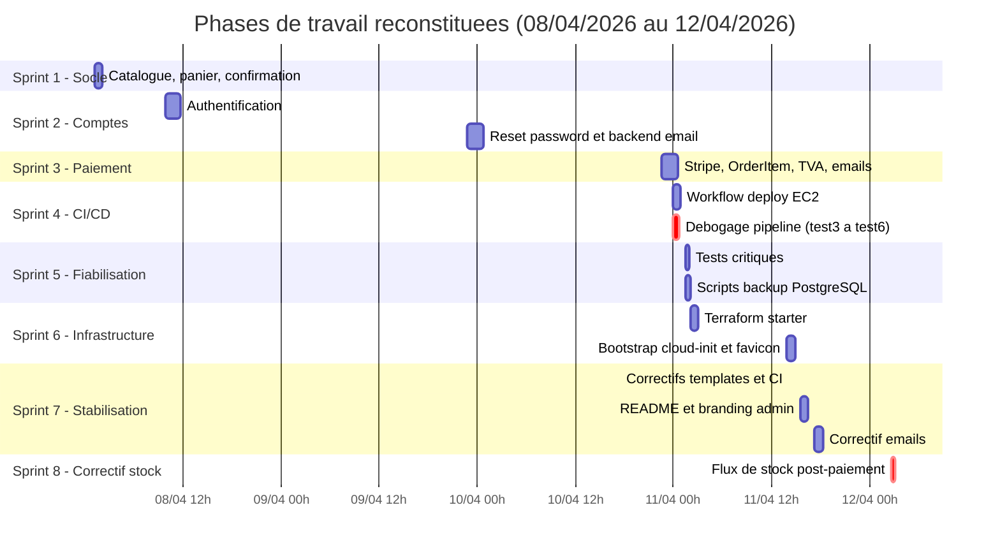
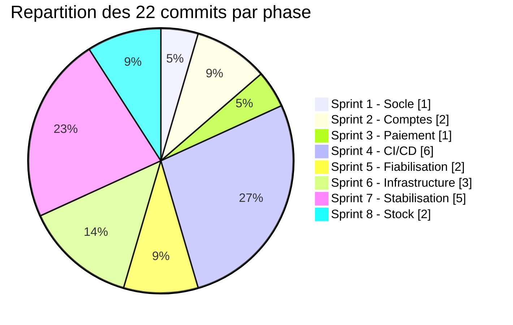

# Historique du projet

Reconstitution à partir de `git log` : **22 commits**, un seul auteur, du **08/04/2026 à 01h12** au **12/04/2026 à 02h49**, soit **4 jours et 1 heure** de développement effectif. Branche unique `main`, historique strictement linéaire (aucune branche, aucun merge).

L'auteur apparaît sous deux identités git : `WANKAM Dypue Dilane Junior` (21 commits, poste local) et `Dypue Dilane Junior WANKAM` (1 commit, `e75041d`, réalisé depuis l'interface web GitHub — c'est une suppression de fichier).

> Note sur les dates : les migrations `0001` à `0003` portent des dates de génération antérieures au premier commit (04/04 et 06/04). Le travail a donc commencé environ 4 jours avant la première mise sous git.

---

## Vue d'ensemble des phases

---

## Sprint 1 — Socle applicatif (08/04, 01h12)

**1 commit** · `3cf1240` « Fin de la partie tutoriel : système de panier et confirmation fonctionnels »

Import initial d'un projet issu d'un tutoriel, livré d'un bloc : 39 fichiers.

- Squelette Django complet (`manage.py`, `ecommerce/`, `shop/`).
- Modèles `Category` et `Product`, puis `Commande` (migrations 0001 à 0003 déjà présentes dans ce commit).
- 5 templates : `base`, `index`, `detail`, `checkout`, `confirmation`.
- `shop/tests.py` créé (vide ou minimal à ce stade).

**Signature de cette phase :** le message de commit revendique explicitement la fin d'une phase d'apprentissage. À ce stade, `Product.price` est un `FloatField`, `Commande.total` un `CharField`, et le panier est stocké dans un champ texte `Commande.items` — trois choix qui seront tous corrigés plus tard. `db.sqlite3` et les fichiers `__pycache__/*.pyc` entrent dans le dépôt dès ce commit, avant l'existence du `.gitignore` : c'est l'origine de la dette 1.4 de l'audit.

---

## Sprint 2 — Comptes utilisateurs (08/04 au 09/04)

**2 commits**, deux sessions distinctes séparées par ~13 heures.

### 2a. `65a84de` — « Authentification » (08/04, 09h47)

Session matinale, 40 fichiers touchés. C'est la phase la plus dense en refonte de schéma.

- Migrations **0004 à 0006** : correction des types monétaires (`price` FloatField → Decimal, `total` CharField → Decimal), passage de `auto_now` à `auto_now_add`, ajout de `Commande.status`, ajout de `Product.stock`, et rattachement `Commande.user` → `User`.
- Templates d'inscription, connexion, profil.
- Première vague de templates de réinitialisation de mot de passe, créés **en triple** : `Templates/admin/`, `shop/templates/admin/` et `shop/templates/registration/`. C'est là que naissent les 10 templates morts recensés dans l'audit.

### 2b. `ccb80d9` — « Mise en place finale du reset password » (09/04, 22h51)

Session nocturne de finalisation.

- Création de `shop/backends.py` (`EmailOrUsernameModelBackend`) et `shop/forms.py` (`SignupForm`, `EmailAuthenticationForm`) : la connexion par email devient possible.
- **Création du `.gitignore` et du `.env.example`** — la configuration par variables d'environnement arrive ici. Trop tard pour `db.sqlite3` et les `.pyc`, déjà indexés.
- `Templates/admin/base_site.html` : début de la personnalisation de l'admin.

**Signature de cette phase :** l'authentification est traitée en deux temps, une session de construction puis une session de finition, avec un intervalle d'une journée.

---

## Sprint 3 — Paiement et normalisation du modèle (10/04, 22h38)

**1 commit** · `bab2c4c` « stripe »

Le commit le plus lourd du projet en volume de logique métier : **8 migrations écrites à la main** (0007 à 0014) livrées en une seule fois, avec le message le plus court de tout l'historique.

Ce qui est fait ici :

- Création de `shop/services.py` — extraction d'une couche métier hors des vues, seule séparation de responsabilités du projet.
- **Normalisation du panier** : création du modèle `OrderItem` (0007), migration de données rétro-active depuis le champ texte `Commande.items` (0008), puis suppression de ce champ (0013).
- Champs de paiement Stripe (0009) avec la contrainte `unique` sur `stripe_checkout_session_id`.
- Suppression de `Product.available` (0010), devenu redondant avec `stock`.
- Bascule des images : ajout de `image_file` en `ImageField`, `image` devient optionnel (0011).
- Verrou anti-double-envoi d'email (0012) et champs de TVA avec reprise des commandes historiques (0014).
- Templates d'email de confirmation (texte + HTML).
- Création de `requirements.txt` — les dépendances sont épinglées pour la première fois, 3 jours après le début.

**Signature de cette phase :** c'est un rattrapage de conception. Les erreurs de modélisation du sprint 1 (prix flottant, panier sérialisé en texte, drapeau `available`) sont toutes soldées ici, avec des migrations de données pour ne rien perdre. Le passage de migrations auto-générées à des migrations manuelles marque un changement de maîtrise.

---

## Sprint 4 — CI/CD et débogage du pipeline (10/04 23h55 → 11/04 00h40)

**6 commits en 45 minutes.** La phase la plus agitée de l'historique.

| Commit | Heure | Message | Fichier touché |
|---|---|---|---|
| `ddce133` | 23h55 | Add CI/CD deploy workflow for EC2 | `deploy.yml` (création) |
| `54a0ed3` | 00h00 | Improve deploy diagnostics for SSH and secrets | `deploy.yml` |
| `b144e67` | 00h33 | **test3** | `deploy.yml` |
| `351334a` | 00h36 | **test4** | `deploy.yml` |
| `4323f80` | 00h38 | **test5** | `deploy.yml` |
| `55333c7` | 00h40 | **test6** | `deploy.yml` |

Les quatre derniers commits ne touchent qu'un seul fichier et portent des messages numérotés. C'est la signature caractéristique du **débogage d'un pipeline CI** : un workflow GitHub Actions ne peut être testé qu'en étant poussé, chaque essai devient donc un commit. L'espacement — 33 min, puis 3, 2 et 2 minutes — montre une première recherche longue suivie d'itérations rapides une fois la piste trouvée.

La numérotation commence à « test3 » : deux essais antérieurs ont probablement été faits autrement (amend ou push forcé).

**Signature de cette phase :** l'infrastructure de déploiement est écrite avant que l'application ne soit testée. Les incohérences `dilane-shop` / `ecom` et `.venv` / `Ecom` relevées dans l'audit naissent ici, car `deploy.yml` est écrit **avant** `bootstrap.sh` (qui n'apparaîtra qu'au sprint 6) : le workflow suppose un serveur configuré à la main, dont les conventions ne seront jamais reportées dans le bootstrap automatisé.

---

## Sprint 5 — Fiabilisation (11/04, 01h28 → 01h35)

**2 commits en 7 minutes.**

### `0a33d0d` — « Add critical checkout/auth tests and fix navbar template flow » (01h28)

**C'est le seul commit du projet qui ajoute des tests.** Il touche exactement deux fichiers : `shop/tests.py` et `base.html`. Les tests écrits ici sont ciblés sur ce qui compte : le prix recalculé côté serveur malgré un prix client falsifié, le blocage sur stock insuffisant, la protection du checkout par authentification.

### `7aa22ee` — « Add PostgreSQL backup and restore scripts with ops guide » (01h35)

Ajout de `scripts/backup_postgres.sh`, `scripts/restore_postgres.sh` et `docs/ops-backup.md`. Premier réflexe d'exploitation du projet. C'est aussi ici qu'apparaît le chemin `/home/ubuntu/ecommerce`, qui divergera de celui du bootstrap.

**Signature de cette phase :** courte poussée de qualité, intercalée entre deux blocs d'infrastructure. Elle explique pourquoi la couverture de tests est à la fois pertinente et très partielle : elle date d'une seule session de 7 minutes, et rien ne l'a enrichie depuis — notamment pas le webhook Stripe, écrit au sprint 3, ni le correctif de stock du sprint 8.

---

## Sprint 6 — Infrastructure as Code (11/04, 02h04 → 13h54)

**3 commits**, coupés par une nuit.

### `b830f65` — « Add Terraform AWS starter » (02h04)

Création de `infra/terraform/` : `versions.tf`, `variables.tf`, `main.tf`, `outputs.tf`, `README.md`, `.gitignore`, plus `terraform.tfvars.example` et `docs/terraform-next-step.md`.

### `e75041d` — « Delete infra/terraform/terraform.tfvars.example » (10h49, via GitHub web)

Suppression du fichier d'exemple, 9 heures plus tard, depuis le navigateur. Le seul commit réalisé hors du poste de développement — vraisemblablement une réaction après relecture, le fichier ayant pu contenir des valeurs réelles. **Le `README.md` de Terraform n'a pas été mis à jour** et continue de documenter `cp terraform.tfvars.example terraform.tfvars` (dette 3.11 de l'audit).

### `4344d66` — « Terraform bootstrap + favicon site/admin » (13h54)

Ajout de `bootstrap.sh` (cloud-init complet : paquets système, clone, `.env`, venv, migrations, Gunicorn, Nginx) et du favicon. C'est le commit qui fige les conventions `/home/ubuntu/e-commerce`, venv `Ecom` et service `ecom` — en contradiction avec `deploy.yml` écrit 14 heures plus tôt.

**Signature de cette phase :** l'infrastructure est bâtie en deux couches successives par deux auteurs de fichiers qui ne se parlent pas. Les trois incohérences bloquantes de l'audit (§5.1 à §5.3) se cristallisent toutes dans l'intervalle entre le sprint 4 et ce commit.

---

## Sprint 7 — Stabilisation et documentation (11/04, 14h14 → 17h18)

**5 commits en 3 heures**, dont un aller-retour.

| Commit | Heure | Message |
|---|---|---|
| `082507f` | 14h14 | Fix navbar template if/endif syntax for CI |
| `d33e2a3` | 14h17 | **test5** |
| `2227103` | 14h20 | **Revert "test5"** |
| `52b363d` | 15h31 | Fix admin base template block syntax |
| `1b127e5` | 17h18 | Fix confirmation email parsing and add HTML fallback |

Le trio `082507f` → `d33e2a3` → `2227103` se déroule en 6 minutes sur le seul fichier `base.html` : un essai posé puis annulé proprement par un `git revert` — le seul revert de tout l'historique.

Deux commits mentionnent explicitement la CI (« for CI ») : le pipeline mis en place au sprint 4 remplit son office et détecte des erreurs de syntaxe de template que le développement local n'avait pas révélées.

`52b363d` apporte, sous un message qui n'en parle pas, **la création du `README.md` racine** — la documentation principale du projet arrive dans un commit intitulé « Fix admin base template block syntax ».

`1b127e5` corrige `services.py` : c'est le commit qui introduit le repli HTML de l'email de confirmation, avec interception de l'échec de rendu.

**Signature de cette phase :** stabilisation classique de fin de projet. Les messages de commit cessent de correspondre à leur contenu réel.

---

## Sprint 8 — Correctif du flux de stock (12/04, 02h40 → 02h49)

**2 commits en 9 minutes**, les derniers du dépôt.

### `3b15062` — « Fix stock flow: decrement only after Stripe payment confirmation » (02h40)

Correction de fond, touchant `models.py`, `views.py`, `tests.py` et ajoutant la migration `0015_commande_stock_deducted`. Le stock cesse d'être décrémenté au moment du checkout ; il ne l'est plus que dans le webhook Stripe, après confirmation effective du paiement, sous le contrôle du nouveau drapeau `stock_deducted`. La logique de réincrémentation à l'annulation et à l'expiration est ajoutée en parallèle.

C'est le **seul commit hors du sprint 5 à modifier `shop/tests.py`** : trois tests y sont ajoutés pour verrouiller le nouveau comportement (`test_stock_ne_decremente_pas_avant_paiement`, `test_commande_creee_avec_stock_deducted_false`, et l'adaptation de `test_insufficient_stock_blocks_order`).

### `890a472` — « Fix mes commandes template formatting » (02h49)

Retouche de mise en forme de `mes_commandes.html`. Dernier commit du dépôt.

**Signature de cette phase :** un vrai correctif métier, accompagné de ses tests — la démarche la plus mature de l'historique. Le projet s'arrête là, sur une correction de présentation.

---

## Lectures transversales

### Rythme de travail

- **Travail majoritairement nocturne.** 11 commits sur 22 se situent entre 22h00 et 03h00. Les trois sessions les plus productives en logique métier (sprints 3, 4 et 8) sont toutes nocturnes.
- **Deux phases absorbent la moitié des commits** (11 sur 22) sans produire de fonctionnalité : le débogage du pipeline (sprint 4) et la stabilisation des templates (sprint 7).
- **Densité très inégale.** `bab2c4c` livre 8 migrations, un module de services et l'intégration Stripe complète ; `55333c7` modifie quelques lignes de YAML. Les deux comptent pour un commit.

### Qualité des messages de commit

Trois registres coexistent :

| Registre | Exemples | Nombre |
|---|---|---|
| Descriptif et précis (anglais, verbe à l'impératif) | « Fix stock flow: decrement only after Stripe payment confirmation » | 12 |
| Vague ou lapidaire | « stripe », « Authentification » | 4 |
| Jetable | « test3 » à « test6 », « test5 », « Revert "test5" » | 6 |

Le basculement du français vers l'anglais intervient au commit `ddce133` (mise en place de la CI/CD) et ne s'inverse plus ensuite.

### Ce que l'historique explique de l'état actuel du code

| Dette constatée dans l'audit | Origine dans l'historique |
|---|---|
| `db.sqlite3` et 17 `.pyc` versionnés | Commités en `3cf1240` et `65a84de`, **avant** la création du `.gitignore` en `ccb80d9` |
| Types monétaires corrigés a posteriori | Choix du sprint 1 (tutoriel), soldés en migration 0004 au sprint 2 |
| 10 templates morts, 5 doublons `admin/` | Trois arborescences de templates de reset créées simultanément en `65a84de` |
| Incohérences `dilane-shop`/`ecom` et `.venv`/`Ecom` | `deploy.yml` écrit au sprint 4 pour un serveur manuel ; `bootstrap.sh` écrit 14 h plus tard au sprint 6, sans relire le workflow |
| `STRIPE_WEBHOOK_SECRET` absent du bootstrap | Stripe intégré au sprint 3, bootstrap écrit au sprint 6 : la variable n'a jamais été remontée dans `variables.tf` |
| Couverture de tests partielle | Tests écrits en une seule session de 7 minutes au sprint 5, plus trois ajouts au sprint 8. Le webhook, écrit au sprint 3, n'a jamais été couvert rétroactivement |
| `infra/terraform/README.md` cassé | `terraform.tfvars.example` supprimé en `e75041d` sans mise à jour de la documentation |
| Chemins de sauvegarde divergents | `/home/ubuntu/ecommerce` figé au sprint 5, `/home/ubuntu/e-commerce` figé au sprint 6 |

Le fil conducteur est constant : **chaque couche a été écrite en supposant l'état de la précédente, sans y revenir.** Le code applicatif a bénéficié de deux passes de rattrapage explicites (migration 0004 au sprint 2, normalisation `OrderItem` au sprint 3) ; l'infrastructure et la documentation n'en ont eu aucune.
