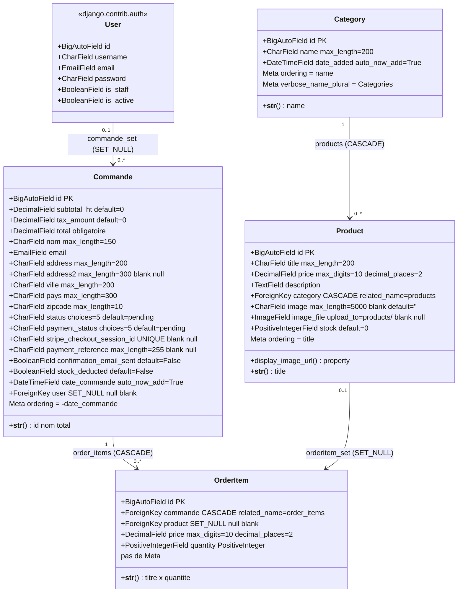

# Modèle de données

Source : `shop/models.py` (91 lignes, 4 modèles) et `shop/migrations/` (15 migrations).
État observé au 20/09/2026. `manage.py makemigrations --check` ne détecte aucun écart entre les modèles et les migrations.

---

## 1. Diagramme de classes

**Cardinalités et types de relations observés :**

| Relation | Type | `on_delete` | `related_name` | Nullable |
|---|---|---|---|---|
| `Product.category` → `Category` | ForeignKey (N–1) | `CASCADE` | `products` | non |
| `Commande.user` → `User` | ForeignKey (N–1) | `SET_NULL` | *(défaut : `commande_set`)* | oui |
| `OrderItem.commande` → `Commande` | ForeignKey (N–1) | `CASCADE` | `order_items` | non |
| `OrderItem.product` → `Product` | ForeignKey (N–1) | `SET_NULL` | *(défaut : `orderitem_set`)* | oui |

**Aucune relation ManyToMany ni OneToOne n'existe dans ce schéma.** La relation logique « une commande contient plusieurs produits » est matérialisée par la table d'association explicite `OrderItem`, qui porte ses propres attributs (`price`, `quantity`) — ce qui exclut un `ManyToManyField` simple.

**Contraintes de base de données :**

- Clés primaires : `BigAutoField` implicite sur les 4 modèles (Django 6 utilise `BigAutoField` comme `DEFAULT_AUTO_FIELD` global ; ni `settings.py` ni `ShopConfig` ne le redéfinissent).
- Unicité : une seule contrainte, `Commande.stripe_checkout_session_id` (`unique=True`, avec `null=True`).
- Aucune `Meta.constraints`, aucun `Meta.indexes`, aucun `unique_together`.
- Aucun `validators=` sur aucun champ.
- `PositiveIntegerField` sur `Product.stock` et `OrderItem.quantity` : contrainte `CHECK >= 0` au niveau base.

---

## 2. Rôle métier par modèle

### 2.1 `Category`

| Champ | Type | Contraintes | Rôle métier observé |
|---|---|---|---|
| `id` | BigAutoField | PK | Identifiant technique. |
| `name` | CharField(200) | obligatoire, non unique | Libellé de la catégorie. Affiché dans le filtre déroulant de `index.html` et dans l'admin. |
| `date_added` | DateTimeField | `auto_now_add=True` | Date de création. Affichée en `list_display` de l'admin. Un commentaire dans le code (`models.py:7`) marque la correction de `auto_now` vers `auto_now_add`, faite en migration 0004. |

**Rôle global :** taxonomie plate à un seul niveau (pas de catégorie parente). Sert uniquement au filtrage du catalogue via le paramètre GET `category` dans `index` et `search_products`. `Meta.ordering = ['name']`, `verbose_name_plural = 'Catégories'`.

### 2.2 `Product`

| Champ | Type | Contraintes | Rôle métier observé |
|---|---|---|---|
| `id` | BigAutoField | PK | Identifiant utilisé dans l'URL `/​<int:myid>` et comme clé du panier `localStorage`. |
| `title` | CharField(200) | obligatoire | Nom du produit. Cible de la recherche `title__icontains`. Indexé dans `search_fields` de l'admin. |
| `price` | DecimalField(10,2) | obligatoire | **Prix de référence faisant autorité.** Le serveur relit systématiquement ce champ au checkout et ignore tout prix envoyé par le client (`views.py:170`). |
| `description` | TextField | obligatoire | Description longue, affichée sur `detail.html`. |
| `category` | FK → Category | CASCADE, `related_name='products'` | Rattachement au catalogue. La suppression d'une catégorie supprime ses produits. |
| `image` | CharField(5000) | `blank=True, default=''` | URL d'image externe. Commenté « URL legacy » dans le code — conservé depuis la phase tutoriel. |
| `image_file` | ImageField | `upload_to='products/'`, blank, null | Upload local, ajouté en migration 0011. Prioritaire sur `image`. |
| `stock` | PositiveIntegerField | `default=0` | Quantité disponible. Contrôlé au checkout, décrémenté seulement au webhook Stripe, réincrémenté à l'annulation/expiration. `list_editable` dans l'admin. |

**Propriété `display_image_url`** (`models.py:32-36`) : retourne `image_file.url` si un fichier est présent, sinon `image`, sinon `''`. C'est le point de bascule entre l'ancien et le nouveau stockage d'image.

**Rôle global :** fiche produit du catalogue. Unique source de vérité pour le prix et le stock.

### 2.3 `Commande`

| Champ | Type | Contraintes | Rôle métier observé |
|---|---|---|---|
| `id` | BigAutoField | PK | Référence client affichée (`#<id>`) dans la confirmation et l'email. |
| `subtotal_ht` | DecimalField(10,2) | `default=0` | Montant hors taxes, calculé serveur par somme de `price × quantity`. |
| `tax_amount` | DecimalField(10,2) | `default=0` | Montant de TVA, calculé par `calculate_tax_totals` avec arrondi `ROUND_HALF_UP` à 2 décimales. |
| `total` | DecimalField(10,2) | obligatoire | Montant TTC = `subtotal_ht + tax_amount`. C'est le montant facturé. |
| `nom` | CharField(150) | obligatoire | Nom du client, saisi au checkout. Champ obligatoire validé côté vue. |
| `email` | EmailField | obligatoire | Destinataire de l'email de confirmation et `customer_email` de la session Stripe. Champ obligatoire validé côté vue. |
| `address` | CharField(200) | obligatoire | Adresse de livraison ligne 1. Champ obligatoire validé côté vue. |
| `address2` | CharField(300) | blank, null | Complément d'adresse, facultatif. |
| `ville` | CharField(200) | obligatoire au modèle | Ville. Non contrôlée par la vue (peut être enregistrée vide). |
| `pays` | CharField(300) | obligatoire au modèle | Pays, issu d'un `<select>` du formulaire. Non contrôlé par la vue. |
| `zipcode` | CharField(10) | obligatoire au modèle | Code postal. Rétréci de 300 à 10 caractères en migration 0003. Non contrôlé par la vue. |
| `status` | CharField(20) | 5 choix, défaut `pending` | **Statut logistique** : `pending`, `confirmed`, `shipped`, `delivered`, `cancelled`. Passé à `confirmed` automatiquement par `sync_commande_payment_from_stripe` ; les états `shipped` et `delivered` ne sont atteignables que manuellement via l'admin (`list_editable`). |
| `payment_status` | CharField(20) | 5 choix, défaut `pending` | **Statut de paiement**, distinct du précédent : `pending`, `processing`, `paid`, `failed`, `cancelled`. Pilote l'affichage de la page de confirmation et le vidage du panier. L'état `failed` n'est écrit nulle part dans le code. |
| `stripe_checkout_session_id` | CharField(255) | **UNIQUE**, blank, null | Identifiant de session Stripe. Clé de rapprochement principale du webhook. Seule contrainte d'unicité du schéma. |
| `payment_reference` | CharField(255) | blank, null | `payment_intent` Stripe, écrit après confirmation du paiement. Sert de référence comptable. Dans `search_fields` de l'admin. |
| `confirmation_email_sent` | BooleanField | `default=False` | Verrou d'idempotence de l'email : empêche le double envoi, car 3 chemins de code peuvent déclencher l'envoi. |
| `stock_deducted` | BooleanField | `default=False` | Verrou d'idempotence du stock : garantit que le décrément n'a lieu qu'une fois et pilote la réincrémentation à l'annulation. Ajouté en migration 0015. |
| `date_commande` | DateTimeField | `auto_now_add=True` | Horodatage de création. Base du tri `Meta.ordering = ['-date_commande']`. |
| `user` | FK → User | SET_NULL, null, blank | Propriétaire du compte. `SET_NULL` conserve la commande si le compte est supprimé. Base du filtrage de la vue `profil`. |

**Rôle global :** entité centrale. Elle agrège trois responsabilités dans une seule table — l'adresse de livraison, l'état de la transaction Stripe, et les verrous d'idempotence (`confirmation_email_sent`, `stock_deducted`). Elle ne stocke plus les articles depuis la migration 0013.

### 2.4 `OrderItem`

| Champ | Type | Contraintes | Rôle métier observé |
|---|---|---|---|
| `id` | BigAutoField | PK | Identifiant technique. |
| `commande` | FK → Commande | CASCADE, `related_name='order_items'` | Commande de rattachement. La suppression de la commande supprime ses lignes. |
| `product` | FK → Product | SET_NULL, null, blank | Produit commandé. `SET_NULL` permet de supprimer un produit du catalogue sans détruire l'historique des ventes. |
| `price` | DecimalField(10,2) | obligatoire | **Prix figé au moment de la commande.** C'est la raison d'être du champ : il désolidarise l'historique des variations de `Product.price`. |
| `quantity` | PositiveIntegerField | obligatoire, ≥ 0 | Quantité commandée. Base du décrément et de la réincrémentation de stock. |

**`__str__`** (`models.py:89-91`) gère explicitement le produit supprimé en retournant `'Produit supprimé'`. La même défense se retrouve dans `admin.py:30` et `services.py:44`.

**Rôle global :** ligne de commande normalisée, introduite en migration 0007 pour remplacer le champ texte `Commande.items`. C'est elle qui rend possibles l'affichage détaillé du panier dans l'admin, le contenu de l'email de confirmation, et la gestion fiable du stock.

---

## 3. Historique des migrations

15 migrations, du 04/04/2026 au 12/04/2026. Les migrations 0001 à 0006 ont été générées par `makemigrations` ; à partir de 0007, elles sont écrites à la main (l'en-tête « Generated by Django » disparaît).

| # | Fichier | Date | Ce qu'elle change |
|---|---|---|---|
| 0001 | `0001_initial.py` | 04/04 17:43 | Création de `Category` (`name`, `date_added` en `auto_now`) et `Product` (`title`, `price` en **FloatField**, `description`, `image` CharField(5000) obligatoire, FK `category` avec `related_name='categorie'`). Tri initial : `Category` par `-date_added`, `Product` par `-category__date_added`. |
| 0002 | `0002_commande.py` | 06/04 23:04 | Création de `Commande` avec un champ **`items` CharField(300)** stockant le panier sérialisé. `zipcode` en CharField(300), `address2` obligatoire, `date_commande` en `auto_now`. Aucun champ `total`. |
| 0003 | `0003_alter_commande_options_commande_total_and_more.py` | 07/04 21:09 | Ajout de `Commande.total` en **CharField(200)** avec `default='500'` et `preserve_default=False`. `address2` devient `blank/null`. `zipcode` réduit de 300 à 10. Tri des commandes par `-date_commande`. |
| 0004 | `0004_alter_category_options_alter_product_options_and_more.py` | 08/04 00:09 | **Migration de correction de types.** `Product.price` : FloatField → `DecimalField(10,2)`. `Commande.total` : CharField → `DecimalField(10,2)`. `Commande.items` : CharField(300) → TextField. `date_added` et `date_commande` : `auto_now` → `auto_now_add`. `Product.category.related_name` : `categorie` → `products`. Ajout de `Commande.status` (5 choix). Ajout de **`Product.available`** (BooleanField, défaut True). Tris révisés : `Category` par `name` avec `verbose_name_plural='Catégories'`, `Product` par `title`. |
| 0005 | `0005_product_stock.py` | 08/04 00:49 | Ajout de `Product.stock` (`PositiveIntegerField`, défaut 0). |
| 0006 | `0006_commande_user.py` | 08/04 01:19 | Ajout de `Commande.user` (FK vers `AUTH_USER_MODEL`, `SET_NULL`, null, blank). Rattache les commandes aux comptes. `swappable_dependency` déclarée. |
| 0007 | `0007_orderitem.py` | — (manuelle) | Création du modèle **`OrderItem`** (`commande` CASCADE `related_name='order_items'`, `product` SET_NULL, `price`, `quantity`). Première étape de la normalisation du panier. |
| 0008 | `0008_backfill_orderitem_from_commande_items.py` | — (**data migration**) | Reprise de données : parcourt chaque `Commande`, décode le JSON de `commande.items`, et crée les `OrderItem` correspondants par `bulk_create`. Ignore les commandes ayant déjà des lignes, les JSON invalides (`TypeError`/`JSONDecodeError`), les entrées non-dict et les quantités < 1. Résout les produits par `id` avec repli sur `None`. Reverse : no-op. |
| 0009 | `0009_commande_payment_fields.py` | — (manuelle) | **Arrivée de Stripe dans le schéma.** Ajout de `payment_reference` (CharField 255, blank/null), `payment_status` (5 choix, défaut `pending`) et `stripe_checkout_session_id` (CharField 255, **unique**, blank/null). |
| 0010 | `0010_remove_product_available.py` | — (manuelle) | **Suppression de `Product.available`**, ajouté en 0004. La disponibilité est désormais déduite de `stock`. |
| 0011 | `0011_product_image_file.py` | — (manuelle) | Ajout de `Product.image_file` (`ImageField`, `upload_to='products/'`). `Product.image` devient `blank=True, default=''` (il était obligatoire depuis 0001). Bascule URL externe → upload local. |
| 0012 | `0012_commande_confirmation_email_sent.py` | — (manuelle) | Ajout de `Commande.confirmation_email_sent` (BooleanField, défaut False). Verrou anti-double-envoi d'email. |
| 0013 | `0013_remove_commande_items.py` | — (manuelle) | **Suppression de `Commande.items`.** Achève la normalisation entamée en 0007-0008 : le panier n'existe plus que sous forme de lignes `OrderItem`. |
| 0014 | `0014_commande_tax_fields.py` | — (**schéma + data**) | Ajout de `subtotal_ht` et `tax_amount` (DecimalField(10,2), défaut 0). Puis `RunPython` de reprise : pour chaque commande où `subtotal_ht == 0 and tax_amount == 0 and total > 0`, recopie `total` dans `subtotal_ht` et laisse `tax_amount` à 0 — les commandes historiques sont donc traitées comme sans TVA. Reverse : `RunPython.noop`. |
| 0015 | `0015_commande_stock_deducted.py` | — (manuelle) | Ajout de `Commande.stock_deducted` (BooleanField, défaut False). Accompagne le correctif de flux de stock du commit `3b15062`. |

### Lectures transversales de cette chronologie

- **Trois champs ont vécu puis disparu ou changé de type** : `Commande.items` (0002 → TextField en 0004 → repris en 0008 → supprimé en 0013), `Product.available` (créé en 0004, supprimé en 0010), `Commande.total` (CharField(200) en 0003 → DecimalField en 0004).
- **Deux erreurs de typage monétaire ont été corrigées en 0004** : `Product.price` en `FloatField` et `Commande.total` en `CharField`. Les commentaires laissés dans `models.py:19` et `models.py:59` (« plus FloatField », « plus CharField ») documentent ces corrections.
- **Deux migrations de données existent** (0008 et la partie `RunPython` de 0014), toutes deux avec un reverse no-op : elles ne sont pas réversibles en pratique.
- **Les migrations 0007 à 0014 sont toutes datées du même commit** `bab2c4c` (« stripe », 10/04) : 8 migrations écrites à la main ont été livrées en une seule fois.
- Aucune migration n'ajoute d'index explicite ni de contrainte `CHECK` métier.
